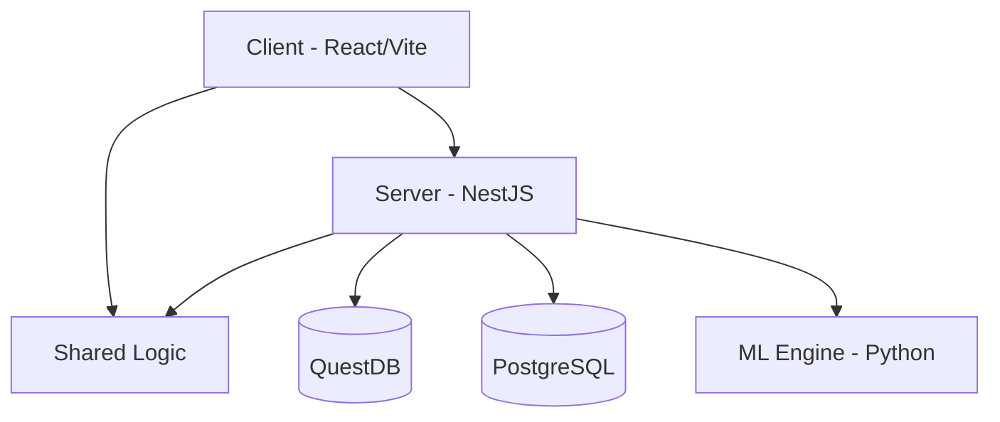

# Architecture Overview: QuantAI Dashboard

Institutional-grade, modular trading and analysis platform adhering to SOLID principles.

## 1. Triple-Engine Data Architecture (Lambda)

| Layer | Technology | Role |
| :--- | :--- | :--- |
| **Speed** | **QuestDB** | High-frequency ILP-over-HTTP ingestion, fast OHLCV via REST fast-path. |
| **Batch** | **DuckDB** | Ephemeral data wrangling, massive .parquet loading for training. |
| **Serving** | **PostgreSQL** | Relational metadata, Model Catalog state, strategy querying. |

## 2. Module Boundaries

- **Client (`src/client`)**: React 19 + Radix UI. Standardized `Layout` and `AppRoute` logic.
- **Server (`src/server`)**: NestJS backend providing a robust DI container and lifecycle hooks.
- **ML Engine (`src/ml`)**: PyTorch-based training and inference engine.
- **Shared (`src/shared`)**: Type definitions and utility functions used by both Client and Server.

## 3. Enforcement Tools

- **Architecture Validator**: Run `npm run check:architecture` to verify module boundaries.
- **Type Checking**: Strict TypeScript configurations in `tsconfig.json`.
- **Linting**: Dual-stack linting via `eslint` (TS) and `ruff` (Python).

## 4. Key Workflows

1. **Ingest**: Ticks arrive from QuestDB -> normalized by the Server -> served via API.
2. **Training**: User triggers via UI -> SAGA in Server orchestrates Python process -> Progress streamed via SSE.
3. **Audit**: Indicators and TA calculations are audited via `audit_and_calculate_ta.py` for precision.

## 5. Connectivity & Speed

- **MotiveWave Bridge**: Optimized Java ILP client using async batching and `TCP_NODELAY`.
- **Fast-Pulse Logic**: Sub-10ms UI propagation via `/api/motivewave/pulse` endpoint and SSE broadcast.
- **Bulk Access**: High-speed HTTP REST path for Node.js and Python, bypassing standard PG wire overhead for 1.5x throughput gains.
