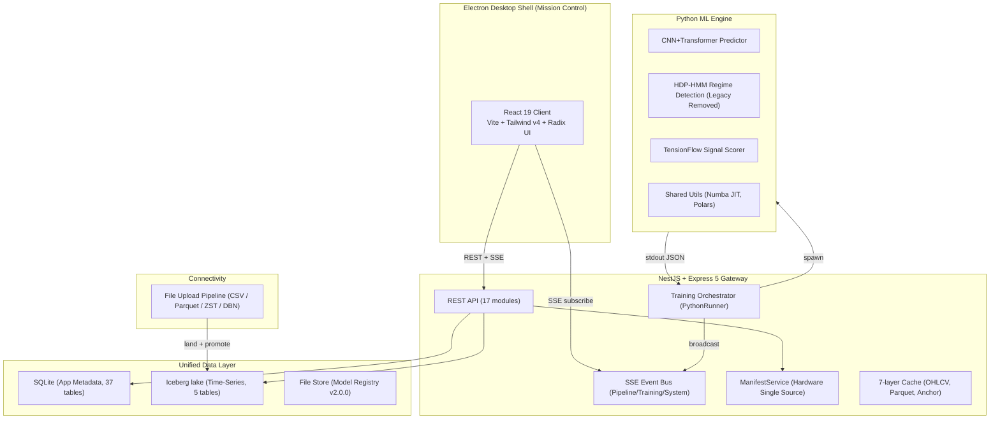

# Quant AI Dashboard: Institutional Mission Control

[](https://github.com/Outtsett/ml_dashboard/actions/workflows/ci.yml)
[](https://github.com/Outtsett/ml_dashboard/actions/workflows/codeql.yml)
[](https://github.com/Outtsett/ml_dashboard/actions/workflows/secret-scan.yml)
[](https://github.com/Outtsett/ml_dashboard/actions/workflows/dependency-review.yml)
[](./LICENSE)
[](./package.json)
[](./pyproject.toml)
[](./tsconfig.json)
[](https://www.conventionalcommits.org)

Full-stack ML ops and real-time execution platform for high-frequency quantitative trading. Integrated with **Mission Control HUB** (PowerShell 7 + Btop++), featuring a **Triple-Engine Data Architecture** and **SOLID-enforced** engineering standards.

> **License:** Source-Available View-Only ([`LICENSE`](./LICENSE)). Code is published for portfolio review only — cloning, forking, modifying, redistributing, executing, and using as AI/ML training data are all prohibited. See [`SECURITY.md`](./SECURITY.md) for vulnerability reporting and [`CONTRIBUTING.md`](./CONTRIBUTING.md) for the internal contribution workflow.

---

### 🟢 ALL SYSTEMS OPERATIONAL
- **Lake Health**: [Active] (863M+ rows in Iceberg at `E:\lake`, read in-process by DuckDB)
- **GPU Pulse**: [Ready] (NVIDIA RTX 5060 Ti, 12GB VRAM)
- **Hardware Integration**: [Synchronized] (ManifestService v2.1.0)

---

## 1. Core Architecture (The Triple-Engine Lambda)

| Layer | Technology | Operational Role |
| :
### 2.4 Analytics & Studies Mandate (DIKW Framework)
All analysis must rigorously follow the **DIKW** path: **Data ? Information ? Knowledge ? Wisdom**.
- **Descriptive Analytics (Information)**: What is the data telling us?
- **Diagnostic Analytics (Knowledge)**: Why is this happening? (Root Cause Analysis).
- **Predictive Analytics (Knowledge)**: What will happen next? (Classification/Regression).
- **Prescriptive Analytics (Wisdom)**: What action should we take?

Every analytical report must be fully processed and permanently housed in the **Studies** tab (src/client/src/studies/pages/). All future analytics and analysis must be saved into a dedicated Study.
--- | :--- | :--- |
| **System of record** | **Iceberg lake** (`E:\lake`) | Every byte of market data. 863M+ OHLCV rows, namespace `market`, catalog AIStor at `:9100/_iceberg`. |
| **Serving + batch** | **DuckDB** | Reads the lake in-process — timeframe aggregation, data wrangling, Polars-native .parquet loading. No server, no port. |
| **Serving** | **PostgreSQL** | Relational metadata, **Model Registry v2.0.0** state, and complex strategy persistence. |

### System Map


---

## 2. Institutional Integrity Mandates

### 2.1 Terminology (Semantic Standard)
We adhere to the **Registry v2.0.0** naming philosophy. Purge all legacy retail terminology.
- **Directional Edge**: Replaces win-rate / directional accuracy.
- **Confidence Edge**: Replaces AUC / model probability separation.
- **Microstructure**: Replaces Swing ZigZag (legacy patterns).
- **Structural Pivots**: Significant local highs/lows.
- **RET_LOG_1M**: Forward 1-minute Log Return (Standardized Target).

### 2.2 Aesthetic Standards (Mission Control HUD)
- **Palette**: Muted Institutional (Emerald-500, Blue-500, Amber-500, Red-500).
- **Visuals**: Borderless HUD layout, raised half-ring radial gauges.
- **Glows**: Subtle text-shadows only; zero-vibrancy glare policy.

### 2.3 Informational Architecture
- **Models**: All models follow the **Registry v2.0.0** spec in `models.json`.
- **Metrics**: All metrics are **Semantic** (self-describing, target-aware, and prescriptive).
- **Telemetry**: Real-time hierarchical naming (e.g., `telemetry/activations/layer-0/mean`).

---

## 3. Tech Stack

| Layer | Technology |
|---|---|
| **Frontend** | React 19, Wouter, TanStack Query, Tailwind CSS v4, Radix UI, Recharts, Lightweight Charts, Three.js, Framer Motion |
| **Backend** | NestJS 11, Express 5, TypeScript, Node.js 22, Drizzle ORM |
| **ML Engine** | PyTorch 2.11+CUDA 12.8, Numba JIT, Polars, Pydantic 2.12 |
| **Data stores** | Iceberg lake at `E:\lake` via DuckDB (market data), SQLite (app metadata) |     
| **Desktop** | Electron 34 |
| **Data Flow** | SSE Delta Encoding, MessagePack, IndexedDB OHLCV Cache (24h TTL) |
| **Hardware** | RTX 5060 Ti, 24-core Ryzan, 128GB RAM |

---

## 4. Operational Workflows

### 4.1 Ingestion
1. **File Upload Pipeline**: CSV / Parquet / ZST / DBN uploads are standardized, landed write-once in `E:\lake
awendor=<name>\` with a `.sha256` sidecar, then promoted into the Iceberg tables.
2. **Lake Persistence**: 863M+ rows across 5 unified tables (`ohlcv`, `symbols`, `ticks`, `dom_l2`, `dom_summary`). The historical tick/DOM data was produced by an external live feed that was removed on 2026-07-27 — the data stays queryable, but nothing streams new bars in.

### 4.2 Training Pipeline (Institutional Workflow)
- **Dashboard Telemetry**: Stream metrics via the SSE protocol (`emit_metric` / `emit_fold_complete`); declare the metric schema up front with `emit_metric_declarations`.
- **Probabilistic Heads**: Default to uncertainty-aware heads (Mean + Variance) + Gaussian NLL loss.
- **Walk-Forward Validation**: Mandatory 8-fold expanding window simulation.
- **O(1) Memory Normalization**: Numba JIT online algorithms for massive dataset features.

### 4.3 Mission Control HUD (Terminal)
- **btop++**: Global `F8` access for hardware monitoring.
- **vdata**: Blazing fast Polars previewer for `.parquet` and `.csv` files.
- **Unified Gateway**: PowerShell 7 interface with health checks on startup.

---

## 5. Development Standards

- **SOLID Principles**: Universally enforced across TS and Python.
- **Recursive READMEs**: Mandatory `README.md` for every folder explaining purpose and linkages.
- **Zero-Friction Autonomy**: All commands must be non-interactive and CI-compatible.
- **Line-by-Line Commentary**: Complex logic must have inline `#` or `//` explanation.

---

## 6. Quick Start (Mission Control Protocol)

```bash
# 1. Activate Environment (Anaconda/Conda)
conda activate base

# 2. Install Dependencies
npm install
pip install -e .

# 3. Synchronize Database Schema
npm run db:push

# 4. Start Mission Control (Databases + API + Electron)
npm run electron:dev

# 5. Jump to Root
dash
```

### Verifying a change

```bash
npm run ci              # all 12 gates, ~3.4 min — mirrors .github/workflows/ci.yml
npm run ci:local:fast   # same, minus build/smoke/e2e
npm run smoke           # does the built artifact boot and serve?
npm run test:e2e        # 91 Playwright tests against the production build
```

> **GitHub Actions has not executed since 2026-08-25** — every run is
> `startup_failure` with zero jobs created, an account/billing condition rather
> than a workflow defect. Until it is cleared, `npm run ci` is the gate.
> Details, and what each gate proves: [`docs/CI-CD.md`](docs/CI-CD.md).
> End-to-end specifics: [`e2e/README.md`](e2e/README.md).

---

## 7. Project Structure (Domain-Driven Map)

```
ml_dashboard/
├── src/
│   ├── client/       # React 19 Frontend (335 components, 28 pages)
│   ├── server/       # NestJS/Express Backend (17 route modules)
│   ├── ml/           # Python ML models & features (Registry v2.0.0)
│   ├── shared/       # Shared TS types & Drizzle schemas
│   ├── config/       # Single source of truth (models.json, features.json)
│   └── scripts/      # Architecture & performance validators
├── electron/         # Desktop shell integration
├── mcp_server/       # FastMCP server for Claude.ai/Code integration
├── data/             # SQLite DB, model checkpoints, parquet cache
└── docs/             # Institutional specs & architectural diagrams
```

---

## 8. License

**MIT** - Institutional Trading Research Platform
