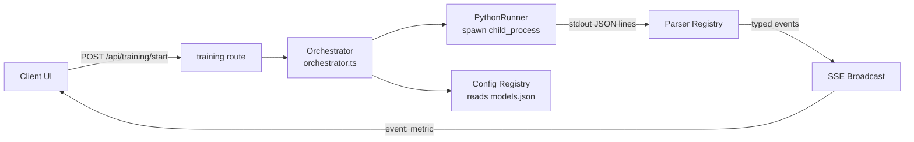

# Training — ML Training Pipeline

Server-side training orchestration. Manages Python process lifecycle, parses stdout metrics, broadcasts events via SSE, and persists results.

## Architecture

## Files

| File | Purpose |
|---|---|
| `orchestrator.ts` | Central coordinator: `startTraining`, `stopTraining`, session management, artifact collection |
| `registry.ts` | Config reader: loads `src/config/models.json`, `features.json`, `training.json` |

### `runners/`
| File | Purpose |
|---|---|
| `types.ts` | `ITrainerRunner` interface, session management, SSE event buffering |
| `pythonRunner.ts` | Spawns Python scripts as child processes, pipes stdout through parser, handles lifecycle |

### `runners/parsers/`
Model-type-specific stdout parsers. Each parser knows how to extract metrics from its model's JSON output format.

### `hpo/`
HPO (Hyperparameter Optimization) orchestration. Manages Optuna study sessions, trials, and parameter application.

## Key Patterns

- **PythonRunner** spawns `python main.py` with CLI args derived from `models.json` config. The runner reads stdout line-by-line, parses JSON events via the model-specific parser, and forwards typed events to the SSE adapter.
- **ITrainerRunner** interface enables adding new runner types (e.g., TFJSRunner) without changing the orchestrator.
- **Parser registry** routes stdout parsing to the correct parser based on model type. Each parser knows its model's metric names, event shapes, and diagnostic format.
- **Session management**: Each training run gets a unique session ID. Sessions track state (running, completed, failed), duration, and artifact paths.
