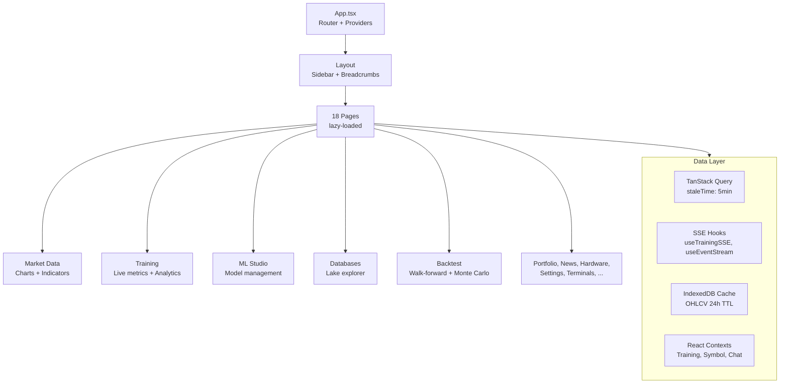

# Client — React 19 Frontend

React 19 single-page application with Vite HMR, Tailwind CSS v4, and shadcn/ui component library. 335 component files across 18 pages. All routing via Wouter with lazy-loaded routes wrapped in `ErrorBoundary` + `Suspense`.

## Architecture



## Directory Structure

```
src/client/
  public/             Static assets, service worker (sw.js)
  src/
    App.tsx           Root component, route definitions, provider tree
    main.tsx          Entry point, error recovery, SW registration
    index.css         Tailwind v4 styles
    pages/            18 page components (lazy-loaded)
    components/       Domain + UI components
      ui/             58 shadcn/ui primitives (Radix-based)
      renderers/      15 metric renderers + MetricGrid (self-describing)
      training/       Training UI: live, analytics, HPO, model tabs
      visualizations/ 8 data visualization types
      chart/          TradingChart internals
      sidebar/        Navigation sidebar
      layout/         App layout shell
      terminal/       Xterm.js terminal
    hooks/            43 custom hooks (SSE, data, UI state)
    contexts/         11 React contexts (training, symbol, chat, overlays)
    lib/              Utilities, calculators, registries
      calculators/    151 technical indicators (8 calculator modules)
      candles/        60 candlestick pattern detectors
      models/         300+ ML model spec definitions (catalog)
      training/       SSE handler utilities
      curriculum/     Learning path definitions
    config/           Client-side model type configs
    types/            TypeScript type definitions
```

## Key Patterns

- **Self-describing diagnostics**: Models emit metric declarations; the dashboard renders whatever the model declares via 15 renderer types. No model-specific UI code needed.
- **Client-side indicators**: All 151 technical indicators computed from raw OHLCV bars in the browser. Calculator files in `lib/calculators/`, registry in `lib/indicator_registry.ts`, dispatch in `lib/indicator_compute.ts`.
- **SSE streaming**: `useTrainingSSE` uses a 5000-slot ring buffer with 50ms microbatch flushes (~2-3 renders/sec). `useSSEConnection` handles exponential backoff reconnection.
- **React Compiler**: `babel-plugin-react-compiler` auto-memoizes all components. No manual `React.memo` / `useMemo` / `useCallback`.
- **Virtual scrolling**: `VirtualList` component wraps react-window v2 for large datasets.
- **IndexedDB OHLCV cache**: `lib/ohlcv_cache.ts` persists chart bars client-side (24h TTL) for instant reload.
- **MessagePack**: OHLCV endpoint supports binary MessagePack responses for ~50% smaller payloads.

## Pages

| Route | Page | Description |
|---|---|---|
| `/` | MarketData | Candlestick charts, 151 indicators, regime overlays |
| `/ml-studio` | MLStudio | Model management dashboard |
| `/model-catalog` | ModelCatalog | 300+ model specs browser |
| `/databases` | Databases | Lake explorer, query console, upload |
| `/portfolio` | Portfolio | Position tracking, allocation, trade history |
| `/watchlist` | Watchlist | Symbol watchlist |
| `/news` | News | News feed with sentiment |
| `/hardware` | Hardware | CPU/GPU/RAM telemetry |
| `/terminals` | Terminals | Embedded terminal (xterm.js) |
| `/fourier` | FourierTransform | FFT/Hilbert analysis |
| `/architecture` | ArchitectureExplorer | ML architecture comparison |
| `/settings` | Settings | App configuration |

## Connections

- Communicates with server via REST (`lib/api_service.ts`) and SSE (hooks)
- Uses `@shared/*` path alias for shared types from `src/shared/`
- TanStack Query manages all server state with 5min global staleTime
- Training contexts split into 4 granular providers for minimal re-renders
