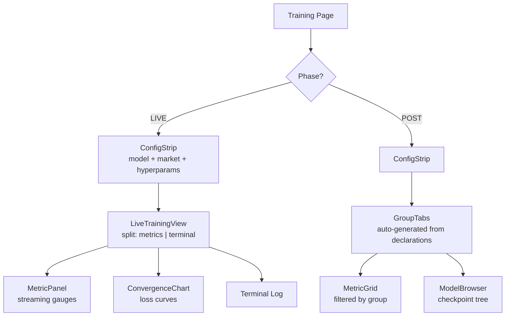

# Training — Training UI Components

80+ components for the Training page. Phase-aware adaptive layout: LIVE phase shows streaming metrics + terminal log; POST phase shows auto-generated group tabs with analytics.

## Architecture

## Top-Level Files

| File | Purpose |
|---|---|
| `ConfigStrip.tsx` | Inline config cards: model picker, market selector, hyperparameters, run/stop controls |
| `LiveTrainingView.tsx` | Split layout: streaming metrics (left) + terminal log (right) + awaiting group pills |
| `GroupTabs.tsx` | Auto-generated tab navigation from metric declarations (model-agnostic) |
| `ModelBrowser.tsx` | Collapsible trained-model tree: type -> instrument -> checkpoints |
| `ModelPicker.tsx` | Model type selection |
| `ModelCatalogPicker.tsx` | Browse model catalog to select training target |
| `ModelTabs.tsx` | Tab container for model inspection |
| `HyperparameterForm.tsx` | Dynamic hyperparameter form from model config |
| `HPOConfigPanel.tsx` | HPO configuration panel |
| `TrainingModeSelector.tsx` | Training vs HPO mode selection |
| `DataPipelineFlow.tsx` | Data pipeline visualization |
| `RegimeDiscoveryViz.tsx` | Regime discovery visualization |
| `MicroComponents.tsx` | Small reusable training UI atoms |
| `modelAdapters.ts` | Model data adapters for consistent interfaces |
| `types.ts` | Training component type definitions |

## Subdirectories

### `live/` — Streaming Metric Components
Components for the live training phase:
- `MetricPanel.tsx` — Real-time metric display
- `ConvergenceChart.tsx` — Loss convergence line chart
- `RegimeCountTracker.tsx` — Regime count evolution
- `TransitionMatrixHeatmap.tsx` — Live transition matrix
- `IterationMetrics.tsx` — Per-iteration metric display

### `analytics/` — Post-Training Analytics (34 components)
Comprehensive analytics for completed training runs:
- Convergence: `ConvergenceAnalytics`, `ParameterTraces`
- Performance: `ClassificationPerformance`, `PerformanceAttribution`, `PerformanceTimeSeries`
- Features: `FeatureCorrelation`, `ShapBeeswarm`, `ShapEvolution`, `PerRegimeShapCards`
- Quality: `QualityGatePanel`, `DataQuality`, `SilhouettePlot`
- Regimes: `RegimeProfileCards`, `RegimeTimeline`, `RegimeCentroidScatter`, `TransitionSankey`
- Trading: `BenchmarkComparison`, `ReturnDistributions`, `WalkForwardWindows`
- Infrastructure: `ResourceUsage`, `ModelHistory`
- Summary: `DashboardSummary`, `MetricScorecard`, `RadialGauge`, `RecommendationEngine`

### `hpo/` — HPO Dashboard
- `HPODashboard.tsx` — Main HPO view
- `HPOConvergence.tsx` — Optimization convergence chart
- `HPOTrialsList.tsx` — Trial list with metrics
- `HPOMetricsCards.tsx` — Summary metric cards
- `HPOChartsSection.tsx` — HPO visualization charts
- `TrialComparison.tsx` — Side-by-side trial comparison

### `model-tabs/` — Model Inspection Tabs
- `OverviewPanel.tsx`, `ConvergencePanel.tsx`, `FitPanel.tsx`, `OOSPanel.tsx`
- `RegimesPanel.tsx`, `WalkForwardPanel.tsx`, `ShapHeatmap.tsx`

### `tabs/` — Reusable Tab Components
Used by ML Hub page (not Training page):
- `ConvergenceTab.tsx`, `PerformanceTab.tsx`, `ShapTab.tsx`, `ModelStateTab.tsx`

### `metrics/` — Metric Display
- `UniversalMetricsStrip.tsx`, `CategoryMetricsPanel.tsx`, `CategorySubTabs.tsx`
- `ModelComparisonView.tsx`, `ModelComparisonSelector.tsx`

### `hpo-config/` — HPO Configuration
- `OptimizerSelector.tsx`, `OptimizerConfigFields.tsx`
- `SearchSpaceEditor.tsx`, `SearchDimensionItem.tsx`

### `market-data/` — Market Data Integration
- `TrainingStatusStrip.tsx` — Training status in market data view
