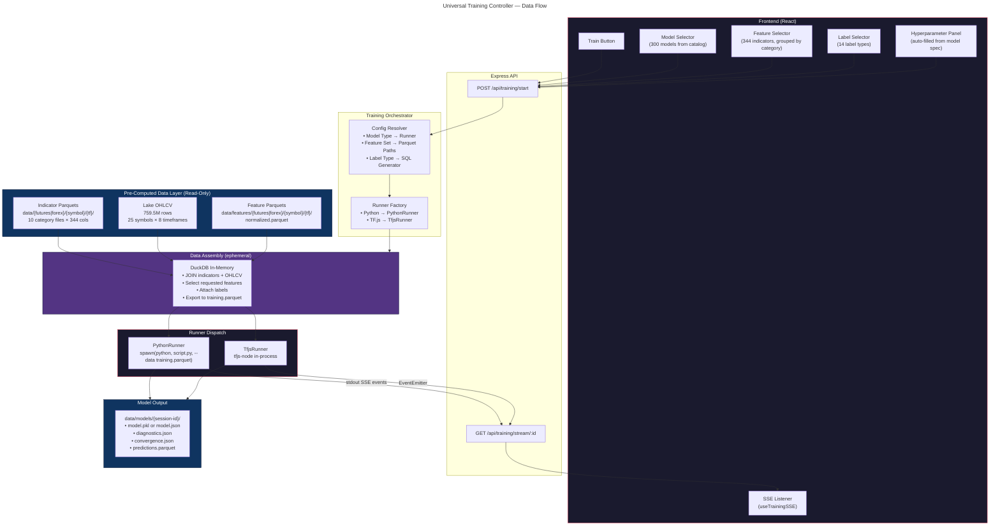
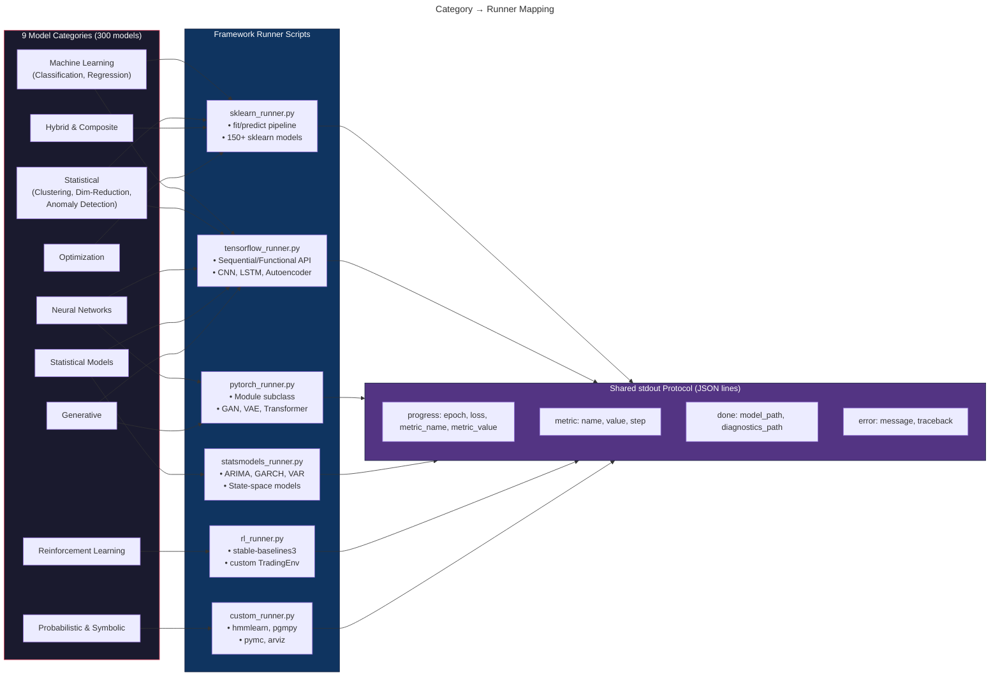
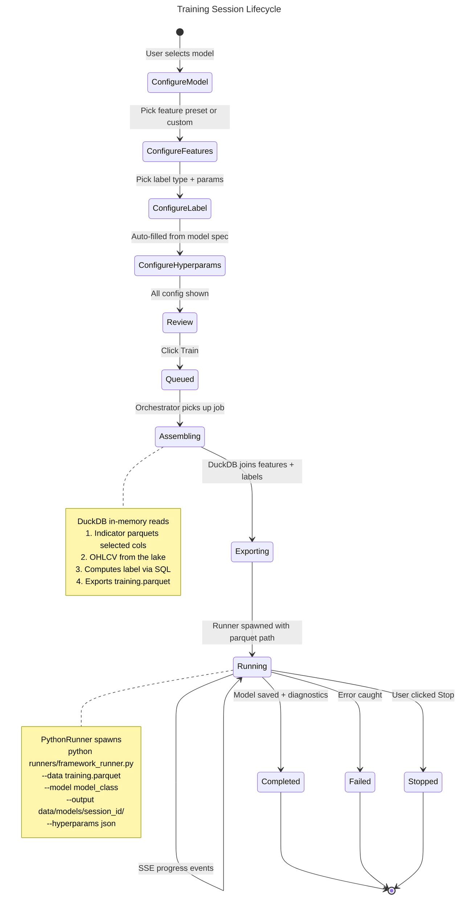

# Universal Training Architecture

> **Goal**: One "Train" button runs any of the 300 catalog models using the same pre-computed, normalized data. The only thing that changes per model: **which features** and **how many**.

---

## System Overview



---

## 1. The Problem Today

| Component                                                      | Status                                                        | Gap                                           |
| -------------------------------------------------------------- | ------------------------------------------------------------- | --------------------------------------------- |
| **Orchestrator** (`server/training/orchestrator.ts`)           | ✅ Built — session management, concurrent limits, SSE dispatch | None                                          |
| **PythonRunner** (`server/training/runners/pythonRunner.ts`)   | ✅ Built — spawn, stdout parsing, timeout, cleanup             | Hardcoded HDP-HMM CLI flag map                |
| **SSE streaming** (`routes/training.ts` + `useTrainingSSE.ts`) | ✅ Built — 10 endpoints, reconnect, replay                     | None                                          |
| **Data Exporter** (`server/training/dataExporter.ts`)          | ✅ Built — lake → parquet via DuckDB                        | Only exports OHLCV, not indicators/features   |
| **`models.json`**                                              | ❌ **EMPTY** `{ "version": 1, "models": {} }`                  | No model can train                            |
| **`features.json`**                                            | ⚠️ Only `full-344` stub. No presets, no pipelines              | Can't select features                         |
| **Parser registry** (`runners/parsers/index.ts`)               | ⚠️ Empty map — everything falls to DefaultParser               | No model-specific output parsing              |
| **Model adapters** (`components/training/modelAdapters.ts`)    | ⚠️ Empty map — falls to FALLBACK_ADAPTER                       | No per-model UI                               |
| **Pre-computed data** (`data/{futures,forex}/`)                | ✅ 344 cols × 13 symbols × 8 timeframes                        | data/features/ (normalized) not yet generated |

**Think of it as**: The train tracks (orchestrator, SSE, runners) are fully laid. The station (UI) is built. But there are no trains on the tracks — `models.json` is the train schedule, and it's blank.

---

## 2. Data Architecture — Same Data, Different Feature Slices

### 2.1 What Already Exists

```
data/{futures|forex}/{symbol}/{timeframe}/
  ├── candle.parquet     → 62 pattern columns (CDL_DOJI, CDL_HAMMER, ...)
  ├── cycle.parquet      →  2 columns (EBSW, Reflex)
  ├── momentum.parquet   → 62 columns (RSI_14, MACD_12_26_9, ...)
  ├── other.parquet      → 67 columns (miscellaneous)
  ├── overlap.parquet    → 68 columns (SMA_10, EMA_21, BB, Ichimoku, ...)
  ├── performance.parquet→  2 columns (Log Return, Pct Return)
  ├── statistics.parquet → 10 columns (Entropy, Kurtosis, Z-Score, ...)
  ├── trend.parquet      → 28 columns (ADX_14, AROON, PSAR, ...)
  ├── volatility.parquet → 25 columns (ATR_14, NATR, True Range, ...)
  └── volume.parquet     → 18 columns (OBV, CMF, MFI, ...)
                           ────
                           344 total indicator columns
```

**Coverage**: 8 timeframes × 2–13 symbols each. Best at `1d` (13 symbols).

### 2.2 Universal Training Parquet Assembly

**Think of it as**: A buffet line. All the dishes (344 indicators) are pre-cooked. Each model walks down the line and picks only the ones it wants onto its plate (training.parquet). The kitchen (compute-indicators.py) already did all the work.

```mermaid
---
title: "Feature Selection Pipeline"
---
flowchart TB
    subgraph RAW["344 Pre-Computed Indicator Columns"]
        C1["Candle Patterns (62)\nCDL_DOJI, CDL_HAMMER..."]
        C2["Momentum (62)\nRSI_14, MACD_12_26_9..."]
        C3["Overlap (68)\nSMA_10, EMA_21, BB..."]
        C4["Other (67)\nmisc indicators"]
        C5["Volatility (25)\nATR_14, NATR..."]
        C6["Volume (18)\nOBV, CMF, MFI..."]
        C7["Trend (28)\nADX_14, AROON..."]
        C8["Statistics (10)\nEntropy, Kurtosis..."]
        C9["Cycle (2)\nEBSW, Reflex"]
        C10["Performance (2)\nLog Return, Pct Return"]
    end

    subgraph PRESETS["Feature Set Presets (features.json)"]
        F1["core-12\nRSI, MACD, ATR, BB,\nSMA, EMA, ADX, OBV,\nStoch, CCI, Williams, ROC"]
        F2["momentum-30\nAll momentum + key trend"]
        F3["full-344\nAll 344 columns"]
        F4["custom\nUser picks from UI checklist"]
    end

    subgraph ASSEMBLE["Assembly Query (DuckDB)"]
        Q["SELECT ts, symbol, open, high, low, close, volume,\n  selected_features,\n  computed_label\nFROM read_parquet indicators\nJOIN ohlcv USING ts symbol\nWHERE symbol = X AND ts BETWEEN start AND end\nORDER BY ts"]
    end

    subgraph OUT["Training Parquet"]
        TP["data/training/{session_id}/\n  training.parquet\n  — ts, symbol, OHLCV\n  — N selected features\n  — target label column"]
    end

    RAW --> PRESETS
    PRESETS --> ASSEMBLE
    ASSEMBLE --> OUT

    style RAW fill:#0f3460,stroke:#16213e,color:#fff
    style PRESETS fill:#533483,stroke:#16213e,color:#fff
    style ASSEMBLE fill:#1a1a2e,stroke:#e94560,color:#fff
    style OUT fill:#0f3460,stroke:#16213e,color:#fff
```



### 2.3 Data Assembly Layer (NEW — 3 files, SRP)

The old plan put everything in one file. That violates **SRP** — reading parquets, resolving features, computing labels, and exporting are four separate reasons to change. Split into three focused modules:

| File                                 | Single Responsibility                                                                   |
| ------------------------------------ | --------------------------------------------------------------------------------------- |
| `server/training/featureResolver.ts` | Resolves a feature set name → concrete column list + parquet file paths                 |
| `server/training/labelComputer.ts`   | Delegates to existing SQL label generators, returns label SQL expression                |
| `server/training/dataAssembler.ts`   | Orchestrates: calls featureResolver + labelComputer, runs DuckDB query, exports parquet |

```typescript
// featureResolver.ts — ONE job: resolve feature set → column list + paths
import { getFeatureSet } from './registry';

export interface ResolvedFeatures {
  columns: string[];               // e.g. ["RSI_14", "MACD_12_26_9", ...]
  parquetPaths: string[];          // e.g. ["data/futures/ES/1d/momentum.parquet", ...]
  categories: string[];            // which category files are needed
}

export function resolveFeatures(
  featureSet: string,
  customColumns: string[] | undefined,
  symbol: string,
  timeframe: string,
): ResolvedFeatures { /* ... */ }
```

```typescript
// labelComputer.ts — ONE job: produce the SQL expression for the label column
export interface LabelSQL {
  expression: string;              // e.g. "CASE WHEN LEAD(close, 5) OVER ... END"
  columnName: string;              // e.g. "label"
  requiresOHLCV: boolean;          // most labels need price columns
}

export function buildLabelSQL(
  labelType: string | null,        // null = unsupervised, no label
  params: Record<string, number>,
): LabelSQL | null { /* delegates to existing sqlLabelGenerators registry */ }
```

```typescript
// dataAssembler.ts — ONE job: coordinate the above two + DuckDB export
import { resolveFeatures } from './featureResolver';
import { buildLabelSQL } from './labelComputer';

export interface AssemblyRequest {
  symbol: string;
  timeframe: string;
  dateRange?: { start: string; end: string };
  featureSet: string;
  featureColumns?: string[];
  labelType: string | null;        // null for unsupervised (LSP-safe)
  labelParams?: Record<string, number>;
}

export interface AssemblyResult {
  dataFile: string;
  totalRows: number;
  featureCount: number;
  featureNames: string[];
  labelDistribution: Record<string, number> | null;  // null when unsupervised
  dateRange: { start: string; end: string };
}

export async function assembleTrainingData(req: AssemblyRequest): Promise<AssemblyResult> {
  // 1. Resolve features (delegates to featureResolver)
  const features = resolveFeatures(req.featureSet, req.featureColumns, req.symbol, req.timeframe);
  // 2. Build label SQL (delegates to labelComputer) — null for unsupervised
  const label = req.labelType ? buildLabelSQL(req.labelType, req.labelParams ?? {}) : null;
  // 3. Run DuckDB assembly query + export
  // ... (single-responsibility: only DuckDB orchestration here)
}
```

**DuckDB Query Plan**:
```sql
-- 1. Read indicator parquets (only selected columns)
CREATE TEMP TABLE indicators AS
SELECT ts, {selected_feature_columns}
FROM read_parquet([
  'data/futures/ES/1d/momentum.parquet',
  'data/futures/ES/1d/volatility.parquet',
  'data/futures/ES/1d/overlap.parquet'
  -- only the category files that contain requested columns
]);

-- 2. Read OHLCV from the lake
CREATE TEMP TABLE ohlcv AS
SELECT timestamp AS ts, open, high, low, close, volume
FROM ohlcv_1d
WHERE symbol = 'ES'
  AND timestamp BETWEEN '2020-01-01' AND '2024-12-31'
ORDER BY timestamp;

-- 3. Join + compute label (example: direction)
CREATE TEMP TABLE training AS
SELECT
  o.ts, o.open, o.high, o.low, o.close, o.volume,
  i.*,
  CASE WHEN LEAD(o.close, 5) OVER (ORDER BY o.ts) > o.close THEN 1 ELSE 0 END AS label
FROM ohlcv o
JOIN indicators i ON o.ts = i.ts
WHERE i.{first_feature} IS NOT NULL  -- drop NaN warmup rows
ORDER BY o.ts;

-- 4. Export
COPY training TO 'data/training/{session_id}/training.parquet' (FORMAT PARQUET);
```

---

## 3. Category → Runner Mapping

**Think of it as**: A dispatch desk. Each of the 9 model categories walks up and gets directed to the right workbench (Python runner script). All workbenches produce the same type of output (JSON on stdout), just using different tools.



### 3.1 Python Runner Scripts (6 framework runners)

Each script follows the **same interface**:

```bash
python runners/{framework}_runner.py \
  --data     data/training/{session_id}/training.parquet \
  --model    random_forest \
  --output   data/models/{session_id}/ \
  --hyperparams '{"n_estimators": 100, "max_depth": 10}' \
  --label-col label \
  --task      classification
```

**Stdout protocol** (JSON lines, parsed by PythonRunner → SSE events):

```jsonl
{"type": "progress", "phase": "training", "step": 1, "total": 100, "pct": 1}
{"type": "metric", "iteration": 1, "metrics": {"loss": 0.693, "accuracy": 0.51}}
{"type": "metric", "iteration": 50, "metrics": {"loss": 0.412, "accuracy": 0.78}}
{"type": "progress", "phase": "validation", "step": 1, "total": 1, "pct": 100}
{"type": "metric", "iteration": 100, "metrics": {"loss": 0.389, "accuracy": 0.81, "f1": 0.79}}
{"type": "overlay", "overlayType": "prediction_markers", "timestamps": [...], "assignments": [...]}
{"type": "done", "model_path": "data/models/session_123/model.pkl", "diagnostics_path": "data/models/session_123/diagnostics.json"}
```

### 3.2 Framework → Model Family Mapping

| Runner Script           | Framework           | Model Families                                                                                                                                                        | ~Count |
| ----------------------- | ------------------- | --------------------------------------------------------------------------------------------------------------------------------------------------------------------- | ------ |
| `sklearn_runner.py`     | scikit-learn        | Random Forest, XGBoost, LightGBM, CatBoost, SVM, KNN, Logistic Regression, ElasticNet, Ridge, Lasso, DBSCAN, K-Means, Isolation Forest, PCA, GMM, Spectral Clustering | ~120   |
| `tensorflow_runner.py`  | TensorFlow/Keras    | CNN, LSTM, GRU, Transformer, Autoencoder, VAE, Attention, Seq2Seq, WaveNet                                                                                            | ~60    |
| `pytorch_runner.py`     | PyTorch             | GAN, Diffusion, Graph Neural Net, custom architectures                                                                                                                | ~40    |
| `statsmodels_runner.py` | statsmodels         | ARIMA, GARCH, VAR, Exponential Smoothing, State-Space                                                                                                                 | ~25    |
| `rl_runner.py`          | stable-baselines3   | PPO, A2C, DQN, SAC, TD3, DDPG + custom TradingEnv                                                                                                                     | ~35    |
| `custom_runner.py`      | hmmlearn/pgmpy/pymc | HDP-HMM, Bayesian Networks, Monte Carlo, Particle Filter                                                                                                              | ~20    |

---

## 4. models.json — The Train Schedule

This is the **single biggest gap**. Currently empty. Needs entries for every trainable model type.

### 4.1 Entry Structure

Each entry in `models.json` maps a model type key to its training configuration:

```jsonc
{
  "version": 2,
  "models": {
    "random-forest": {
      "name": "Random Forest",
      "category": "machine-learning",
      "subcategory": "ensemble-methods",
      "runner": "python",
      "script": "scripts/runners/sklearn_runner.py",
      "framework": "sklearn",                              // NEW: which runner script
      "modelClass": "RandomForestClassifier",              // NEW: sklearn class name
      "task": "classification",                            // NEW: classification | regression | clustering | anomaly | generation | rl
      "featurePipeline": "core-30",
      "outputs": ["predictions", "feature_importance", "confusion_matrix"],
      "chartOverlay": "prediction_markers",
      "outputDir": "data/models",
      "requiresDataExport": true,
      "defaultHyperparameters": {
        "n_estimators":  { "value": 100, "min": 10, "max": 1000, "step": 10, "label": "Number of Trees" },
        "max_depth":     { "value": 10,  "min": 1,  "max": 50,   "step": 1,  "label": "Max Tree Depth" },
        "min_samples_split": { "value": 5, "min": 2, "max": 50, "step": 1, "label": "Min Samples to Split" },
        "test_split":    { "value": 0.2, "min": 0.1, "max": 0.4, "step": 0.05, "label": "Test Split Ratio" }
      },
      "defaultLabel": {                                    // NEW: default label config
        "type": "direction",
        "params": { "horizon": 5 }
      },
      "compatibleLabels": [                                // NEW: what labels make sense
        "direction", "signal", "futureReturn", "tripleBarrier", "trendScanning"
      ]
    },
    
    "lstm": {
      "name": "LSTM (Long Short-Term Memory)",
      "category": "neural-network",
      "subcategory": "recurrent-networks",
      "runner": "python",
      "script": "scripts/runners/tensorflow_runner.py",
      "framework": "tensorflow",
      "modelClass": "LSTM",
      "task": "classification",
      "featurePipeline": "full-344",
      "outputs": ["predictions", "attention_weights", "loss_curve"],
      "chartOverlay": "prediction_markers",
      "outputDir": "data/models",
      "requiresDataExport": true,
      "defaultHyperparameters": {
        "epochs":       { "value": 50,   "min": 10,  "max": 500,  "step": 10,  "label": "Training Epochs" },
        "batch_size":   { "value": 32,   "min": 8,   "max": 256,  "step": 8,   "label": "Batch Size" },
        "learning_rate": { "value": 0.001, "min": 0.0001, "max": 0.01, "step": 0.0001, "label": "Learning Rate" },
        "hidden_units": { "value": 64,   "min": 16,  "max": 512,  "step": 16,  "label": "Hidden Units" },
        "dropout":      { "value": 0.2,  "min": 0.0, "max": 0.5,  "step": 0.05, "label": "Dropout Rate" },
        "sequence_length": { "value": 60, "min": 10, "max": 200, "step": 10, "label": "Lookback Window" },
        "test_split":   { "value": 0.2,  "min": 0.1, "max": 0.4,  "step": 0.05, "label": "Test Split Ratio" }
      },
      "defaultLabel": {
        "type": "direction",
        "params": { "horizon": 5 }
      },
      "compatibleLabels": [
        "direction", "signal", "futureReturn", "futureVolatility", "tripleBarrier", "trendScanning"
      ]
    },

    "isolation-forest": {
      "name": "Isolation Forest",
      "category": "machine-learning",
      "subcategory": "anomaly-detection",
      "runner": "python",
      "script": "scripts/runners/sklearn_runner.py",
      "framework": "sklearn",
      "modelClass": "IsolationForest",
      "task": "anomaly",
      "featurePipeline": "core-30",
      "outputs": ["anomaly_scores", "anomaly_labels"],
      "chartOverlay": "anomaly_scores",
      "outputDir": "data/models",
      "requiresDataExport": true,
      "defaultHyperparameters": {
        "n_estimators":   { "value": 100, "min": 50,  "max": 500, "step": 50, "label": "Number of Trees" },
        "contamination":  { "value": 0.05, "min": 0.01, "max": 0.2, "step": 0.01, "label": "Expected Anomaly Ratio" },
        "max_features":   { "value": 1.0, "min": 0.1, "max": 1.0, "step": 0.1, "label": "Feature Fraction" }
      },
      "defaultLabel": null,
      "compatibleLabels": []
    }
  }
}
```

### 4.2 Auto-Generation Strategy

Rather than hand-write 300 entries, we'll build a script that:

1. **Reads the 300 `ParsedModelSpec` records** from the model catalog (already parsed from markdown)
2. **Maps each model's category** → framework runner script using the table in §3.2
3. **Maps each model's hyperparameters** → `HyperparameterDef` format (already extracted by parser)
4. **Sets default feature pipeline** based on task type:
   - Classification/Regression → `core-30` (most relevant features)
   - Deep Learning → `full-344` (let the network learn)
   - Clustering/Anomaly → `momentum-volatility-20` (price behavior signals)
   - RL → `core-30` (observation space = features)
5. **Sets compatible labels** based on task type:
   - Classification → `direction`, `signal`, `tripleBarrier`, `trendScanning`
   - Regression → `futureReturn`, `futureVolatility`
   - Clustering → no labels (unsupervised)
   - Anomaly → no labels (unsupervised)
   - RL → `futureReturn` (reward signal)

**Script**: `scripts/generate-models-json.ts`

---

## 5. features.json — Feature Set Presets

```jsonc
{
  "featureSets": {
    "core-12": {
      "description": "12 essential indicators — the basics every trader knows",
      "columns": [
        "RSI_14", "MACD_12_26_9", "MACDh_12_26_9", "MACDs_12_26_9",
        "ATRr_14", "BBL_20_2.0", "BBM_20_2.0", "BBU_20_2.0",
        "SMA_10", "EMA_21", "ADX_14", "OBV"
      ],
      "categories": ["momentum", "volatility", "overlap", "trend", "volume"]
    },
    "core-30": {
      "description": "30 widely-used features — balanced coverage across categories",
      "columns": [
        "RSI_14", "MACD_12_26_9", "MACDh_12_26_9", "MACDs_12_26_9",
        "STOCHk_14_3_3", "STOCHd_14_3_3", "STOCHRSIk_14_14_3_3",
        "CCI_14_0.015", "WILLR_14", "ROC_10", "MOM_10",
        "ATRr_14", "NATR_14", "BBL_20_2.0", "BBM_20_2.0", "BBU_20_2.0", "BBB_20_2.0",
        "SMA_10", "SMA_20", "SMA_50", "EMA_10", "EMA_21",
        "ADX_14", "AROON_14", "DMP_14", "DMN_14",
        "OBV", "CMF_20", "MFI_14",
        "PCTRET_1"
      ],
      "categories": ["momentum", "volatility", "overlap", "trend", "volume", "performance"]
    },
    "momentum-volatility-20": {
      "description": "Momentum + volatility — ideal for clustering/anomaly detection",
      "columns": [
        "RSI_14", "MACD_12_26_9", "MACDh_12_26_9",
        "STOCHk_14_3_3", "STOCHd_14_3_3", "CCI_14_0.015",
        "WILLR_14", "ROC_10", "MOM_10",
        "ATRr_14", "NATR_14", "BBL_20_2.0", "BBU_20_2.0", "BBB_20_2.0",
        "ADX_14", "DMP_14", "DMN_14",
        "OBV", "MFI_14",
        "PCTRET_1"
      ],
      "categories": ["momentum", "volatility", "trend", "volume", "performance"]
    },
    "full-344": {
      "description": "All available pre-computed indicators — let the model decide",
      "columns": "*",
      "categories": ["candle", "cycle", "momentum", "other", "overlap", "performance", "statistics", "trend", "volatility", "volume"]
    },
    "custom": {
      "description": "User selects individual columns from the UI",
      "columns": [],
      "categories": []
    }
  },
  "pipelines": {
    "standard": {
      "steps": ["read_parquets", "select_features", "compute_label", "drop_na", "split", "export"],
      "splitStrategy": "temporal",
      "testRatio": 0.2,
      "validationRatio": 0.1
    },
    "walk-forward": {
      "steps": ["read_parquets", "select_features", "compute_label", "drop_na", "walk_forward_split", "export"],
      "splitStrategy": "walk-forward",
      "windowSize": 252,
      "stepSize": 63
    },
    "no-label": {
      "steps": ["read_parquets", "select_features", "drop_na", "export"],
      "splitStrategy": "temporal",
      "testRatio": 0.2
    }
  }
}
```

---

## 6. Training Session Lifecycle



### Step-by-Step Sequence

| Step                      | Who                | What Happens                                                                               |
| ------------------------- | ------------------ | ------------------------------------------------------------------------------------------ |
| 1. **Select Model**       | UI                 | User picks from 300-model catalog. Model's `ParsedModelSpec` loaded.                       |
| 2. **Configure Features** | UI                 | Feature preset auto-selected from model config. User can override.                         |
| 3. **Configure Label**    | UI                 | Label type auto-selected from `defaultLabel`. User can change.                             |
| 4. **Tune Hyperparams**   | UI                 | Sliders auto-filled from `defaultHyperparameters`. User can adjust.                        |
| 5. **Click Train**        | UI → API           | `POST /api/training/start` with `TrainingRequest` body.                                    |
| 6. **Resolve Config**     | Orchestrator       | Looks up `models.json[modelType]`, merges features/labels/hyperparams.                     |
| 7. **Assemble Data**      | DataAssembler      | DuckDB reads indicator parquets + OHLCV, computes label, exports `training.parquet`.       |
| 8. **Spawn Runner**       | PythonRunner       | `python scripts/runners/{framework}_runner.py --data training.parquet --model {class} ...` |
| 9. **Stream Progress**    | Runner → SSE       | Script prints JSON lines to stdout → PythonRunner parses → SSE to client.                  |
| 10. **Save Results**      | Runner             | Model saved to `data/models/{session_id}/`. Diagnostics JSON written.                      |
| 11. **Done Event**        | PythonRunner → SSE | `done` event with model path + metrics. Client shows results.                              |

---

## 7. Extended `TrainingRequest` (Client → Server)

The current `TrainingRequest` needs a few new fields to support universal training:

```typescript
export interface TrainingRequest {
  // ─── Existing fields ─────────────────────────
  modelType: string;              // key in models.json (e.g. "random-forest")
  symbol?: string;                // default: "ES"
  timeframe?: string;             // default: "1d"
  dateRange?: { start: string; end: string };
  hyperparameters?: Record<string, number | string | boolean>;

  // ─── NEW fields ──────────────────────────────
  featureSet?: string;            // key from features.json (e.g. "core-30", "custom")
  featureColumns?: string[];      // if featureSet === "custom", explicit column names
  labelType?: string;             // label generator key (e.g. "direction", "tripleBarrier")
  labelParams?: Record<string, number>;  // label-specific parameters
  task?: string;                  // override: "classification" | "regression" | "clustering" | "anomaly" | "rl"

  // ─── Remove (deprecated) ─────────────────────
  // includeIndicators (replaced by featureSet)
  // allFeatures (replaced by featureSet: "full-344")
  // indicatorGroups (replaced by featureSet categories)
}
```

---

## 8. Stdout Protocol — The Universal Language

**All Python runner scripts communicate via JSON lines on stdout.** This is the contract between Python and Node.js. The PythonRunner parses each line and converts it to a typed SSE event.

### 8.1 Event Types

```jsonl
// Progress — phase-level updates
{"type": "progress", "phase": "loading", "step": 1, "total": 5, "pct": 20, "message": "Reading training data..."}
{"type": "progress", "phase": "training", "step": 10, "total": 100, "pct": 10, "message": "Epoch 10/100"}
{"type": "progress", "phase": "validation", "step": 1, "total": 1, "pct": 100, "message": "Computing metrics..."}
{"type": "progress", "phase": "saving", "step": 1, "total": 1, "pct": 100, "message": "Saving model..."}

// Metric — per-iteration numeric values (drives live charts)
{"type": "metric", "iteration": 10, "total": 100, "metrics": {"loss": 0.412, "accuracy": 0.78, "val_loss": 0.445}}

// Overlay — chart overlay data (regimes, predictions, anomaly scores)
{"type": "overlay", "overlayType": "prediction_markers", "timestamps": [1700000000, ...], "assignments": [1, 0, 1, ...]}

// Log — informational messages
{"type": "log", "level": "info", "message": "Using 12 features, 4830 rows, 80/20 split"}

// Done — training complete
{"type": "done", "model_path": "data/models/session_123/model.pkl", "diagnostics": {"accuracy": 0.81, "f1": 0.79, "confusion_matrix": [[1200, 230], [210, 1190]]}}

// Error — training failed
{"type": "error", "message": "CUDA out of memory", "traceback": "..."}
```

### 8.2 Parser Registry (OCP)

The existing parser registry in `server/training/runners/parsers/index.ts` is currently empty. We populate it:

```typescript
// parsers/index.ts — register one parser per framework
import type { TrainingSession } from "@shared/trainingTypes";
import { emitSessionEvent } from "../types";

export interface IOutputParser {
  parseLine(session: TrainingSession, line: string, ctx: ParserContext): void;
}

interface ParserContext {
  modelsDir: string;
  modelId: string;
}

// Universal JSON parser — works for all runners that follow stdout protocol
// OCP: uses a Set of valid event types instead of a switch statement.
// Adding a new event type = add one string to the Set. No other code changes.
const VALID_EVENT_TYPES = new Set<TrainingEvent["type"]>([
  "progress", "metric", "overlay", "log", "done", "error",
]);

class UniversalJsonParser implements IOutputParser {
  parseLine(session: TrainingSession, line: string, _ctx: ParserContext): boolean {
    if (!line.startsWith("{")) return false;
    try {
      const msg = JSON.parse(line);
      if (VALID_EVENT_TYPES.has(msg.type)) {
        emitSessionEvent(session, msg.type, msg);
        return true;
      }
      return false;
    } catch {
      emitSessionEvent(session, "log", { message: line, level: "debug" });
      return true;
    }
  }
}

const registry: Record<string, IOutputParser> = {};
const universalParser = new UniversalJsonParser();

export function getParser(modelType: string): IOutputParser {
  return registry[modelType] ?? universalParser;
}

export function registerParser(modelType: string, parser: IOutputParser) {
  registry[modelType] = parser;
}
```

---

## 9. Label Integration

### 9.1 Available Label Generators (14 types)

| Label Type           | Task           | Output                  | Example Use                             |
| -------------------- | -------------- | ----------------------- | --------------------------------------- |
| `direction`          | Classification | 0/1 (down/up)           | Random Forest, SVM, Logistic Regression |
| `signal`             | Classification | -1/0/1 (sell/hold/buy)  | GBM, XGBoost, Neural Nets               |
| `futureReturn`       | Regression     | float (% return)        | Linear Regression, Ridge, LSTM          |
| `futureVolatility`   | Regression     | float (realized vol)    | GARCH, Bayesian Ridge                   |
| `tripleBarrier`      | Classification | -1/0/1 (TP/timeout/SL)  | Meta-labeling, ensemble models          |
| `trendScanning`      | Classification | 0/1 (trend detected)    | Trend-following models                  |
| `volatilityAdaptive` | Classification | adaptive thresholds     | Regime-aware models                     |
| `multiStep`          | Sequence       | multiple horizons       | Seq2Seq, multi-output models            |
| `npmm`               | Classification | regime labels           | HDP-HMM, GMM                            |
| `metaLabel`          | Classification | 0/1 (correct/incorrect) | Stacking, meta-learners                 |
| `marketRegime`       | Clustering     | regime assignment       | Unsupervised regime detection           |
| `semiSupervised`     | Pseudo-labels  | soft labels             | Self-training, co-training              |
| *(none)*             | Unsupervised   | —                       | Clustering, anomaly detection           |
| *(reward func)*      | RL             | cumulative return       | PPO, DQN, SAC                           |

### 9.2 Label Selection Logic (OCP — registry, not switch)

```typescript
// ❌ WRONG — switch statement violates OCP (adding a new task = editing this function)
// function getDefaultLabel(task: string) { switch (task) { case "classification": ... } }

// ✅ RIGHT — registry map, open for extension without modification
type LabelDefault = { type: string; params: Record<string, number> } | null;

const DEFAULT_LABELS: Record<string, LabelDefault> = {
  classification: { type: "direction", params: { horizon: 5 } },
  regression:     { type: "futureReturn", params: { horizon: 5 } },
  clustering:     null,   // unsupervised — no labels
  anomaly:        null,   // unsupervised — no labels
  rl:             { type: "futureReturn", params: { horizon: 20 } },
  generation:     null,   // generative — no labels
  // Adding a new task type = add one line here. Nothing else changes.
};

export function getDefaultLabel(task: string): LabelDefault {
  return DEFAULT_LABELS[task] ?? null;
}
```

---

## 10. Python Runner Script Template

All 6 framework runners follow the same pattern. Here's the universal skeleton:

```python
#!/usr/bin/env python3
"""Universal sklearn runner — trains any scikit-learn model via CLI."""

import argparse
import json
import sys
import pandas as pd
import numpy as np
from pathlib import Path

# ─── Stdout protocol helpers ─────────────────────────────────────────────────

def emit(event: dict):
    """Write a JSON event to stdout (picked up by PythonRunner)."""
    print(json.dumps(event), flush=True)

def progress(phase: str, step: int, total: int, message: str = ""):
    emit({"type": "progress", "phase": phase, "step": step, "total": total,
          "pct": round(step / total * 100), "message": message})

def metric(iteration: int, total: int, metrics: dict):
    emit({"type": "metric", "iteration": iteration, "total": total, "metrics": metrics})

def done(model_path: str, diagnostics: dict):
    emit({"type": "done", "model_path": model_path, "diagnostics": diagnostics})

def error(message: str, traceback: str = ""):
    emit({"type": "error", "message": message, "traceback": traceback})

# ─── Main ─────────────────────────────────────────────────────────────────────

def main():
    parser = argparse.ArgumentParser()
    parser.add_argument("--data", required=True, help="Path to training.parquet")
    parser.add_argument("--model", required=True, help="Model class name (e.g. RandomForestClassifier)")
    parser.add_argument("--output", required=True, help="Output directory")
    parser.add_argument("--hyperparams", default="{}", help="JSON hyperparameters")
    parser.add_argument("--label-col", default="label", help="Target column name")
    parser.add_argument("--task", default="classification", help="Task type")
    parser.add_argument("--test-split", type=float, default=0.2)
    args = parser.parse_args()

    try:
        hp = json.loads(args.hyperparams)

        # 1. Load data
        progress("loading", 1, 5, "Reading training data...")
        df = pd.read_parquet(args.data)
        
        # 2. Split features / target
        progress("loading", 2, 5, "Splitting features and target...")
        feature_cols = [c for c in df.columns if c not in ["ts", "symbol", "open", "high", "low", "close", "volume", args.label_col]]
        X = df[feature_cols].values
        y = df[args.label_col].values if args.label_col in df.columns else None

        emit({"type": "log", "level": "info",
              "message": f"Data: {len(df)} rows, {len(feature_cols)} features, task={args.task}"})

        # 3. Train/test split (temporal — last N% is test)
        split_idx = int(len(X) * (1 - args.test_split))
        X_train, X_test = X[:split_idx], X[split_idx:]
        y_train, y_test = (y[:split_idx], y[split_idx:]) if y is not None else (None, None)

        # 4. Instantiate model
        progress("training", 3, 5, f"Training {args.model}...")
        model = get_sklearn_model(args.model, hp)  # factory function
        
        if y_train is not None:
            model.fit(X_train, y_train)
        else:
            model.fit(X_train)  # unsupervised

        # 5. Evaluate
        progress("validation", 4, 5, "Computing metrics...")
        diagnostics = compute_diagnostics(model, X_test, y_test, args.task, feature_cols)
        metric(1, 1, diagnostics["summary_metrics"])

        # 6. Save
        progress("saving", 5, 5, "Saving model...")
        output_dir = Path(args.output)
        output_dir.mkdir(parents=True, exist_ok=True)
        
        import joblib
        model_path = str(output_dir / "model.pkl")
        joblib.dump(model, model_path)
        
        diag_path = str(output_dir / "diagnostics.json")
        with open(diag_path, "w") as f:
            json.dump(diagnostics, f, indent=2, default=str)

        done(model_path, diagnostics)

    except Exception as e:
        import traceback
        error(str(e), traceback.format_exc())
        sys.exit(1)

if __name__ == "__main__":
    main()
```

---

## 11. Frontend Controller Changes

### 11.1 New Training Flow UI

The current Training page has placeholder sections. The universal flow needs:

```
┌─────────────────────────────────────────────────────────────────────┐
│  TRAINING CENTER                                                     │
├──────────────────────┬──────────────────────────────────────────────┤
│                      │                                              │
│  1. MODEL SELECTOR   │  2. FEATURE CONFIG          3. LABEL CONFIG  │
│  ┌────────────────┐  │  ┌──────────────────────┐  ┌─────────────┐  │
│  │ [Search...]    │  │  │ Preset: [core-30 ▼]  │  │ Type: [▼]   │  │
│  │                │  │  │                      │  │ • direction  │  │
│  │ ▸ Machine      │  │  │ ☑ RSI_14       │  Mo │  │ • signal     │  │
│  │   Learning     │  │  │ ☑ MACD_12_26_9 │  Mo │  │ • futureRet  │  │
│  │   • Random     │  │  │ ☑ ATR_14       │  Vo │  │ • tripleBar  │  │
│  │     Forest ◄   │  │  │ ☑ SMA_10       │  Ov │  │              │  │
│  │   • XGBoost    │  │  │ ☑ EMA_21       │  Ov │  │ Horizon: [5] │  │
│  │   • SVM        │  │  │ ☐ BBL_20       │  Ov │  │ Threshold:   │  │
│  │ ▸ Neural Nets  │  │  │ ...            │     │  │ [0.001]      │  │
│  │ ▸ Statistical  │  │  │ 30 / 344 selected   │  └─────────────┘  │
│  │ ▸ RL           │  │  └──────────────────────┘                    │
│  └────────────────┘  │                                              │
│                      │  4. HYPERPARAMETERS                          │
│  Symbol: [ES ▼]     │  ┌──────────────────────────────────────────┐│
│  Timeframe: [1d ▼]  │  │ n_estimators  [━━━━━━━━━●━━] 100        ││
│  Date Range:         │  │ max_depth     [━━━━━●━━━━━━] 10         ││
│  [2020] → [2024]    │  │ test_split    [━━●━━━━━━━━━━] 0.20      ││
│                      │  └──────────────────────────────────────────┘│
│  ┌─────────────────┐│                                               │
│  │   🚀 TRAIN      ││  5. LIVE METRICS (during training)           │
│  └─────────────────┘│  ┌──────────────────────────────────────────┐│
│                      │  │ Phase: Training  [████████░░] 80%        ││
│                      │  │ Loss: 0.412   Accuracy: 0.78            ││
│                      │  │ ┌─────────────────────────────────┐     ││
│                      │  │ │ Loss Curve (Recharts)           │     ││
│                      │  │ │ ╲                               │     ││
│                      │  │ │  ╲___                           │     ││
│                      │  │ │      ╲____                      │     ││
│                      │  │ └─────────────────────────────────┘     ││
│                      │  └──────────────────────────────────────────┘│
└──────────────────────┴──────────────────────────────────────────────┘
```

### 11.2 New Hooks

| Hook                           | Purpose                                           |
| ------------------------------ | ------------------------------------------------- |
| `useModelCatalogForTraining()` | Bridge: catalog models → training-compatible list |
| `useFeatureSets()`             | Fetches `features.json` presets for dropdown      |
| `useLabelGenerators()`         | Fetches available label types + their params      |
| `useTrainingConfig()`          | Unified config assembly before submission         |

### 11.3 Model Adapter Registry (ISP — segregated interfaces)

`components/training/modelAdapters.ts` — split into focused interfaces so each component only depends on the fields it uses:

```typescript
// ISP: 3 separate interfaces instead of 1 fat one.
// A badge component doesn't need to know about chart overlays.

/** Used by ModelBadge, category headers, sidebar icons */
export interface ModelBadgeInfo {
  icon: string;                    // Lucide icon name
  color: string;                   // Tailwind color class
}

/** Used by the training configuration panel */
export interface ModelTrainingConfig {
  defaultFeatureSet: string;       // Suggested feature preset
  showLabelPicker: boolean;        // Unsupervised = false
  showSequenceLength: boolean;     // RNNs need lookback window
  showEpochSlider: boolean;        // Only iterative models
}

/** Used by live metrics + post-training results */
export interface ModelResultsConfig {
  metricsToShow: string[];         // Which metrics are relevant
  chartOverlays: string[];         // What to paint on chart
}

/** Full adapter = union of all three (only the registry holds this) */
export interface ModelAdapter extends ModelBadgeInfo, ModelTrainingConfig, ModelResultsConfig {}

const ADAPTERS: Record<AlgoModelCategory, ModelAdapter> = {
  "machine-learning": {
    icon: "TreeDeciduous",
    color: "text-green-500",
    defaultFeatureSet: "core-30",
    showLabelPicker: true,
    showSequenceLength: false,
    showEpochSlider: false,
    metricsToShow: ["accuracy", "f1", "precision", "recall"],
    chartOverlays: ["prediction_markers", "feature_importance"],
  },
  "neural-network": {
    icon: "Brain",
    color: "text-purple-500",
    defaultFeatureSet: "full-344",
    showLabelPicker: true,
    showSequenceLength: true,
    showEpochSlider: true,
    metricsToShow: ["loss", "val_loss", "accuracy", "val_accuracy"],
    chartOverlays: ["prediction_markers", "attention_weights"],
  },
  "reinforcement-learning": {
    icon: "Gamepad2",
    color: "text-red-500",
    defaultFeatureSet: "core-30",
    showLabelPicker: false,      // RL uses reward, not labels
    showSequenceLength: false,
    showEpochSlider: true,
    metricsToShow: ["episode_reward", "win_rate", "sharpe_ratio"],
    chartOverlays: ["trade_markers", "equity_curve"],
  },
  // ... etc for all 9 categories
};

// Components accept only what they need:
// function ModelBadge({ badge }: { badge: ModelBadgeInfo }) { ... }
// function TrainingPanel({ config }: { config: ModelTrainingConfig }) { ... }
// function ResultsView({ results }: { results: ModelResultsConfig }) { ... }
```

---

## 12. Implementation Phases

### Phase 1: Universal Data Assembly (Week 1)
| Task | File                               | Description                                                                                                    |
| ---- | ---------------------------------- | -------------------------------------------------------------------------------------------------------------- |
| 1.1  | `server/training/dataAssembler.ts` | Build data assembly service: read indicator parquets, select features, compute labels, export training.parquet |
| 1.2  | `src/config/features.json`         | Populate feature set presets: `core-12`, `core-30`, `momentum-volatility-20`, `full-344`, `custom`             |
| 1.3  | `server/training/dataAssembler.ts` | Wire label generators into assembly (reuse existing SQL generators)                                            |
| 1.4  | Test                               | Verify: indicator parquets + label → training.parquet for ES/1d with core-30 features                          |

### Phase 2: Fill models.json + Runner Protocol (Week 2)
| Task | File                                       | Description                                                                                      |
| ---- | ------------------------------------------ | ------------------------------------------------------------------------------------------------ |
| 2.1  | `scripts/generate-models-json.ts`          | Script to auto-generate models.json from 300 catalog entries                                     |
| 2.2  | `src/config/models.json`                   | Generate and validate the 300-entry model registry                                               |
| 2.3  | `server/training/runners/parsers/index.ts` | Implement `UniversalJsonParser` — one parser that handles all runner stdout                      |
| 2.4  | `shared/trainingTypes.ts`                  | Extend `TrainingRequest` with `featureSet`, `featureColumns`, `labelType`, `labelParams`, `task` |
| 2.5  | `server/training/orchestrator.ts`          | Wire data assembly step before runner spawn                                                      |

### Phase 3: Python Runner Scripts (Week 3–4)
| Task | File                                    | Description                                                                          |
| ---- | --------------------------------------- | ------------------------------------------------------------------------------------ |
| 3.1  | `scripts/runners/sklearn_runner.py`     | sklearn universal runner — imports model class by name, fit/predict, stdout protocol |
| 3.2  | `scripts/runners/tensorflow_runner.py`  | TensorFlow/Keras runner — builds model from config, epoch callbacks emit JSON        |
| 3.3  | `scripts/runners/pytorch_runner.py`     | PyTorch runner — Module factory, training loop with stdout                           |
| 3.4  | `scripts/runners/statsmodels_runner.py` | Statsmodels runner — ARIMA/GARCH fit, forecast export                                |
| 3.5  | `scripts/runners/rl_runner.py`          | RL runner — stable-baselines3 + custom TradingEnv                                    |
| 3.6  | `scripts/runners/custom_runner.py`      | Custom runner — hmmlearn, pgmpy, pymc dispatch                                       |
| 3.7  | `scripts/runners/base_runner.py`        | Shared utilities: emit(), progress(), metric(), done(), error(), parquet loading     |

### Phase 4: Frontend Universal Training UI (Week 4–5)
| Task | File                                                     | Description                                                          |
| ---- | -------------------------------------------------------- | -------------------------------------------------------------------- |
| 4.1  | `client/src/components/training/ModelSelector.tsx`       | Catalog browser with search, category filter, model cards            |
| 4.2  | `client/src/components/training/FeatureSelector.tsx`     | Preset dropdown + custom column picker (grouped by category)         |
| 4.3  | `client/src/components/training/LabelSelector.tsx`       | Label type picker with parameter inputs                              |
| 4.4  | `client/src/components/training/HyperparameterPanel.tsx` | Auto-generated sliders from model spec hyperparameters               |
| 4.5  | `client/src/components/training/LiveMetrics.tsx`         | Real-time loss curve, metric badges, progress bar                    |
| 4.6  | `client/src/components/training/modelAdapters.ts`        | Category → UI adapter mapping (9 categories)                         |
| 4.7  | `client/src/hooks/useUniversalTraining.ts`               | Assembly of model + features + label + hyperparams → TrainingRequest |
| 4.8  | `client/src/pages/Training.tsx`                          | Wire new components into Training Center page                        |

### Phase 5: Diagnostics & Results (Week 5–6)
| Task | File                                                  | Description                                                |
| ---- | ----------------------------------------------------- | ---------------------------------------------------------- |
| 5.1  | `server/routes/training.ts`                           | Endpoints for diagnostics, convergence, feature importance |
| 5.2  | `client/src/components/training/DiagnosticsPanel.tsx` | Confusion matrix, ROC curve, feature importance bar chart  |
| 5.3  | `client/src/components/training/ModelCompare.tsx`     | Side-by-side comparison of trained model results           |
| 5.4  | Chart overlay                                         | Paint predictions/regimes/anomalies on trading chart       |

### Phase 6: Walk-Forward & Backtesting (Week 6+)
| Task | File                 | Description                                         |
| ---- | -------------------- | --------------------------------------------------- |
| 6.1  | Walk-forward split   | Temporal cross-validation in data assembler         |
| 6.2  | Backtest integration | Trained model → signal generation → backtest engine |
| 6.3  | Model comparison     | Multiple model results on same chart period         |

---

## 13. File Tree — What Gets Built

```
src/
  config/
    models.json                    ← FILL: 300 model entries (auto-generated)
    features.json                  ← FILL: 5 feature presets + 3 pipelines
    training.json                  ← EDIT: add frameworkMapping config (OCP)

  server/training/
    orchestrator.ts                ← EDIT: remove direct PythonRunner import (DIP), inject via factory
    featureResolver.ts             ← NEW: resolve feature set → column list + paths (SRP)
    labelComputer.ts               ← NEW: delegates to SQL label generators (SRP)
    dataAssembler.ts               ← NEW: orchestrates feature+label+DuckDB export (SRP)
    dataExporter.ts                ← EXISTS: OHLCV export (still useful as fallback)
    registry.ts                    ← EDIT: add feature set + label resolution
    runnerFactory.ts               ← NEW: creates runners from config, not hardcoded imports (DIP)
    runners/
      types.ts                     ← EXISTS: no changes needed
      pythonRunner.ts              ← EDIT: remove hardcoded hyperparam map, use generic --hyperparams JSON
      parsers/
        index.ts                   ← FILL: UniversalJsonParser (OCP — Set, not switch)
        hdpHmmParser.ts            ← KEEP: existing HDP-HMM specific parser (OCP)

  shared/
    trainingTypes.ts               ← EDIT: add featureSet, labelType, task; split ModelRegistryEntry (ISP)

  client/src/
    components/training/
      ModelSelector.tsx            ← NEW: catalog browser for training
      FeatureSelector.tsx          ← NEW: preset picker + custom column list
      LabelSelector.tsx            ← NEW: label type + params
      HyperparameterPanel.tsx      ← NEW: auto-generated sliders
      LiveMetrics.tsx              ← NEW: real-time training visualization
      DiagnosticsPanel.tsx         ← NEW: post-training results
      modelAdapters.ts             ← FILL: 9 category adapters (ISP — 3 segregated interfaces)
    hooks/
      useUniversalTraining.ts      ← NEW: config assembly hook
    pages/
      Training.tsx                 ← EDIT: wire new components

scripts/
  runners/
    base_runner.py                 ← NEW: shared Python base (data loading, splitting, saving, stdout)
    diagnostics.py                 ← NEW: compute diagnostics per task type (SRP — extracted from runners)
    sklearn_runner.py              ← NEW: scikit-learn runner (instantiate + fit only — SRP)
    tensorflow_runner.py           ← NEW: TF/Keras runner (build model + train loop only)
    pytorch_runner.py              ← NEW: PyTorch runner (Module factory + train loop only)
    statsmodels_runner.py          ← NEW: statsmodels runner (fit + forecast only)
    rl_runner.py                   ← NEW: stable-baselines3 runner (env + agent only)
    custom_runner.py               ← NEW: hmmlearn/pgmpy/pymc dispatch
  generate-models-json.ts          ← NEW: auto-generate models.json from catalog
```

---

## 14. Key Design Decisions

| Decision                                             | Choice                   | Rationale                                                                                        |
| ---------------------------------------------------- | ------------------------ | ------------------------------------------------------------------------------------------------ |
| **Data assembly happens server-side, not in Python** | TypeScript + DuckDB      | DuckDB is already in-process and reads the lake and loose parquets through one engine, fastest path           |
| **One parser for all models**                        | `UniversalJsonParser`    | All runners emit the same JSON protocol — no per-model parsers needed (except legacy HDP-HMM)    |
| **6 Python runner scripts, not 300**                 | Framework-based grouping | 300 models map to ~6 frameworks. The runner takes `--model ClassName` and imports dynamically    |
| **Feature sets in JSON, not hardcoded**              | `features.json` presets  | Users can add new presets without code changes (OCP). Custom selection is a special "custom" key |
| **Label type is part of training request**           | Required for supervised  | Separates data (features) from target (label). Unsupervised models skip labels                   |
| **models.json is auto-generated**                    | Script reads catalog     | 300 models is too many to hand-write. Catalog already has hyperparameters + categories           |
| **Temporal train/test split, not random**            | Finance requirement      | Random splits leak future data. Walk-forward is Phase 6 upgrade                                  |

---

## 15. SOLID Audit

> Audit of the architecture plan + existing code against the 5 SOLID principles.  
> Each finding shows: what's wrong, why it matters, and the specific fix.

### Found Violations

| #   | Principle | Where                                        | Violation                                                                                                                                                        | Fix                                                                                                                                                                                                                                                               |
| --- | --------- | -------------------------------------------- | ---------------------------------------------------------------------------------------------------------------------------------------------------------------- | ----------------------------------------------------------------------------------------------------------------------------------------------------------------------------------------------------------------------------------------------------------------- |
| 1   | **SRP**   | `dataAssembler.ts` (§2.3)                    | Original plan put 5 responsibilities in one file: read parquets, resolve features, compute labels, join OHLCV, export                                            | Split into 3 files: `featureResolver.ts`, `labelComputer.ts`, `dataAssembler.ts` — each with one reason to change                                                                                                                                                 |
| 2   | **SRP**   | Orchestrator (§6 Step 7)                     | Plan said "wire data assembly step before runner spawn" — but orchestrator's job is session lifecycle, not data prep                                             | Orchestrator calls `dataAssembler` as a dependency. Assembly is NOT inlined into orchestrator.                                                                                                                                                                    |
| 3   | **SRP**   | `sklearn_runner.py` (§10)                    | Template script did: parse args + load data + split + train + evaluate + save. Loading/splitting/saving are shared across all 6 runners                          | Extract shared concerns into `base_runner.py` (load + split + save) and `diagnostics.py` (evaluate). Each runner only does: instantiate model + fit                                                                                                               |
| 4   | **OCP**   | `getDefaultLabel()` (§9.2)                   | `switch(task)` statement — adding a new task type requires editing the function                                                                                  | **FIXED**: replaced with registry map `DEFAULT_LABELS: Record<string, LabelDefault>` — add one line to extend                                                                                                                                                     |
| 5   | **OCP**   | `UniversalJsonParser` (§8.2)                 | `switch(msg.type)` with 6 identical cases — adding a new event type requires editing the switch                                                                  | **FIXED**: replaced with `VALID_EVENT_TYPES` Set — `if (set.has(msg.type)) emitSessionEvent(session, msg.type, msg)`                                                                                                                                              |
| 6   | **OCP**   | Category → Runner mapping (§4.2)             | Auto-generation script uses hardcoded category-to-framework logic                                                                                                | Move mapping to `training.json` as `frameworkMapping` config — scripts read config, never hardcode                                                                                                                                                                |
| 7   | **DIP**   | `orchestrator.ts` (existing code, line 21)   | `import { PythonRunner } from "./runners/pythonRunner"` — direct import of concrete class                                                                        | Create `runnerFactory.ts` that reads `runner` field from config and returns `ITrainerRunner`. Orchestrator receives runners via factory, never imports concrete classes                                                                                           |
| 8   | **DIP**   | `training.ts` route (existing code, line 60) | Route handler manually constructs `TrainingRequest` from `req.body` field-by-field                                                                               | Use Zod schema validation (project convention). Define `trainingRequestSchema = z.object({...})`, then `trainingRequestSchema.parse(req.body)`                                                                                                                    |
| 9   | **ISP**   | `ModelAdapter` interface (§11.3)             | One fat 8-field interface forced on every component — badge component doesn't need `chartOverlays`                                                               | **FIXED**: split into 3 interfaces: `ModelBadgeInfo` (icon + color), `ModelTrainingConfig` (UI toggles), `ModelResultsConfig` (metrics + overlays). Full `ModelAdapter` extends all three                                                                         |
| 10  | **ISP**   | `ModelRegistryEntry` type (§4.1)             | 15+ fields — runner only needs script/framework, UI only needs name/hyperparams, assembler only needs features/labels                                            | Split: `RunnerConfig` (script, framework, modelClass, task, outputDir), `UIConfig` (name, defaultHyperparameters, outputs, chartOverlay, compatibleLabels), `DataConfig` (featurePipeline, defaultLabel, requiresDataExport). `ModelRegistryEntry` = intersection |
| 11  | **LSP**   | `defaultLabel: null` (§4.1)                  | Isolation Forest has `"defaultLabel": null` but the TypeScript type doesn't declare `null` as valid — callers that assume `.defaultLabel.type` exists will crash | **FIXED** in `AssemblyRequest.labelType`: declared as `string                                                                                                                                                                                                     | null`. All label-touching code must null-check first. TypeScript strict mode enforces this |

### Violations Already Fixed in This Doc

- **#4** (OCP getDefaultLabel) — §9.2 rewritten with registry map
- **#5** (OCP UniversalJsonParser) — §8.2 rewritten with Set
- **#9** (ISP ModelAdapter) — §11.3 rewritten with 3 segregated interfaces
- **#11** (LSP defaultLabel) — §2.3 declares `labelType: string | null`

### Violations to Fix in Existing Code

- **#7** (DIP orchestrator.ts) — fix below
- **#8** (DIP training.ts route) — fix below
- **#3** (SRP sklearn_runner.py) — fixed in file tree (§13), `base_runner.py` + `diagnostics.py`
- **#6** (OCP category mapping) — fixed in file tree (§13), `training.json` gets `frameworkMapping`
- **#1, #2** (SRP dataAssembler) — fixed in §2.3, three separate files

### Existing Code Fixes Needed

**Fix #7 — DIP: Orchestrator should not import PythonRunner directly**

```typescript
// ❌ CURRENT (orchestrator.ts line 21)
import { PythonRunner } from "./runners/pythonRunner";
const runners: Record<string, ITrainerRunner> = {
  python: new PythonRunner(),
};

// ✅ FIXED — new file: runnerFactory.ts
// runnerFactory.ts — creates runners from config, not hardcoded imports
import type { ITrainerRunner } from "./runners/types";

const registry = new Map<string, () => ITrainerRunner>();

export function registerRunner(type: string, factory: () => ITrainerRunner) {
  registry.set(type, factory);
}

export function getRunner(type: string): ITrainerRunner {
  const factory = registry.get(type);
  if (!factory) throw new Error(`No runner registered for type: ${type}`);
  return factory();
}

// Registration happens at startup (server/index.ts), not in orchestrator:
// import { PythonRunner } from "./training/runners/pythonRunner";
// registerRunner("python", () => new PythonRunner());
```

**Fix #8 — DIP: Route should use Zod validation, not inline construction**

```typescript
// ❌ CURRENT (training.ts line 60-69)
const request: TrainingRequest = {
  modelType: req.body.modelType,
  symbol: req.body.symbol,
  // ... manually copying each field
};

// ✅ FIXED — Zod schema validates + constructs in one step
import { z } from "zod";

const trainingRequestSchema = z.object({
  modelType: z.string().min(1, "modelType is required"),
  symbol: z.string().optional(),
  timeframe: z.string().optional(),
  dateRange: z.object({ start: z.string(), end: z.string() }).optional(),
  hyperparameters: z.record(z.union([z.number(), z.string(), z.boolean()])).optional(),
  featureSet: z.string().optional(),
  featureColumns: z.array(z.string()).optional(),
  labelType: z.string().nullable().optional(),
  labelParams: z.record(z.number()).optional(),
  task: z.string().optional(),
});

// In route handler:
const request = trainingRequestSchema.parse(req.body);
```

---

## 15. Risks & Mitigations

| Risk                                                           | Mitigation                                                                                                |
| -------------------------------------------------------------- | --------------------------------------------------------------------------------------------------------- |
| **Not all 300 models have sklearn/TF/PyTorch implementations** | Phase 1 covers the ~80% that do. Exotic models get a "not yet implemented" badge in UI                    |
| **Some indicator columns may be mostly NaN**                   | DataAssembler drops NaN rows + logs warning if >20% of rows lost                                          |
| **Different models need different input shapes**               | Sklearn: flat 2D matrix. LSTM: 3D tensor (sequences). Runner scripts handle reshaping                     |
| **Python dependency matrix is huge**                           | `pyproject.toml` already manages deps. Each runner imports only what it needs                             |
| **Label generators may produce imbalanced classes**            | UI shows label distribution before training. Runners support `class_weight="balanced"`                    |
| **Large parquets slow assembly**                               | DuckDB columnar reads only requested columns (projection pushdown). ~344-col scan takes <2s for 100K rows |

---

## Summary

**Think of it as**: The dashboard becomes a universal model workbench. You pick any model from a 300-item catalog (like picking a tool from a toolbox), tell it which indicators to look at (like choosing which charts to put on your screen), pick what you're predicting (direction? return? anomaly?), adjust the knobs, and hit Train. Under the hood, one data assembler prepares the meal, one of six Python chefs cooks it, and a single reporting system tells you how it went — all through the same plumbing that's already built and tested.
