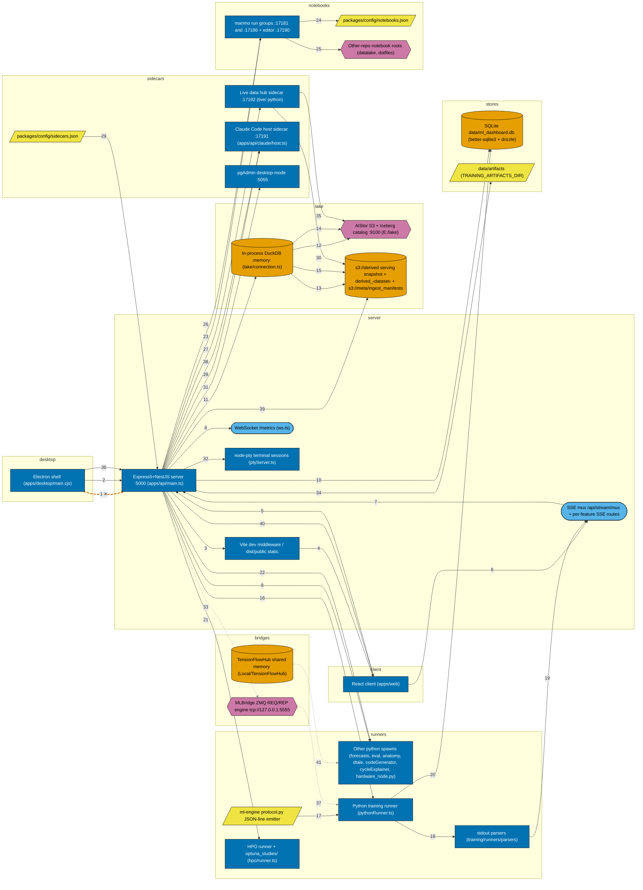

# ML Dashboard: how the pieces connect

> Update this file in the same change as any work that adds, removes or re-points a connection.
> Mapped from source and checked edge by edge on 2026-10-06.

ml_dashboard is one Node process on port 5000 (Express 5 plus NestJS, started by apps/api/main.ts) that serves the React/Vite client, a REST/SSE/WebSocket API, reverse proxies to marimo notebook groups and sidecars, and spawns Python runners whose JSON-line stdout becomes SSE events. State is split between SQLite (data/ml_dashboard.db) and an in-process in-memory DuckDB that reads the E:\lake Iceberg and parquet data over AIStor S3 on port 9100. Electron (apps/desktop/main.cjs) is only a window plus supervisor over that same server; the ZMQ MLBridge client and the TensionFlow shared-memory reader are dormant, with no live peer or writer found.

**41 connections between 26 components:** 37 live, 3 dormant, 1 broken.

## Reading the diagram

Each box is a component; each arrow is one connection, pointing the way data or control moves. The number on an arrow is its row in the table below.

| Mark | Meaning |
|---|---|
| process | running process (rectangle) |
| store | data store (cylinder) |
| external | outside this project (hexagon) |
| file | file or folder (slanted box) |
| interface | interface or protocol (rounded pill) |
| live | solid arrow: the code makes this connection and the other end exists |
| dormant | thin dotted arrow: defined in code, nothing invokes it or nothing answers |
| broken | thick dashed arrow marked ✕: the code points at something that is gone |

## Connections that are not live

| Number | From | To | Status | What is true |
|---|---|---|---|---|
| 1 | Electron shell (apps/desktop/main.cjs) | Express5+NestJS server :5000 (apps/api/main.ts) | broken | apps/desktop/main.cjs resolves paths from apps/: the dev branch (line 1005) and both fallbacks spawn apps/src/server/main.ts, and the production branch (line 1019) looks for apps/dist/index.cjs. None of those exist; the backend is apps/api/main.ts and the bundle is dist/index.cjs at the repo root. |
| 33 | Express5+NestJS server :5000 (apps/api/main.ts) | MLBridge ZMQ REQ/REP engine tcp://127.0.0.1:5555 | dormant | Client is wired in deployment/lifecycle.ts:144 but the REP-side engine peer was not found in this tree; MotiveWave removal left it deliberately without a live peer |
| 37 | MLBridge ZMQ REQ/REP engine tcp://127.0.0.1:5555 | Python training runner (pythonRunner.ts) | dormant | Confirms edge 32 wiring; no REP peer in tree |
| 41 | TensionFlowHub shared memory (Local\TensionFlowHub) | Other python spawns (forecasts, eval, anatomy, dtale, codeGenerator, cycleExplainer, hardware_node.py) | dormant | Line is the file head; file imports shmem per grep match; writer removed so reads zeros |

## Every connection

| Number | From | To | What flows | How | Where it is made | Status |
|---|---|---|---|---|---|---|
| 1 | Electron shell (apps/desktop/main.cjs) | Express5+NestJS server :5000 (apps/api/main.ts) | Spawns backend (tsx --watch apps/api/main.ts, or dist/index.cjs in production) with PORT env; reclaims port 5000 from wedged orphans | child_process.spawn | `apps/desktop/main.cjs:1006` | broken |
| 2 | Electron shell (apps/desktop/main.cjs) | Express5+NestJS server :5000 (apps/api/main.ts) | Health probes (/health, 5s heartbeat) and BrowserWindow.loadURL of the whole UI | HTTP fetch http://127.0.0.1:${PORT}/health; mainWindow.loadURL | `apps/desktop/main.cjs:814` | live |
| 3 | Express5+NestJS server :5000 (apps/api/main.ts) | Vite dev middleware / dist/public static | Dev: Vite in middleware mode serves client with HMR; prod: static files from dist/public | createViteServer({middlewareMode:true}) / serveStatic(expressApp) | `apps/api/infrastructure/core/vite.ts:31` | live |
| 4 | Vite dev middleware / dist/public static | React client (apps/web) | React bundle (apps/web) delivered to the browser/Electron window on the same origin | HTTP on :5000 | `apps/api/infrastructure/core/vite.ts:36` | live |
| 5 | React client (apps/web) | Express5+NestJS server :5000 (apps/api/main.ts) | REST API calls, routers mounted under /api | HTTP; registerRoutes mounts per-feature routers | `apps/api/infrastructure/core/routes.ts:127` | live |
| 6 | React client (apps/web) | SSE mux /api/stream/mux + per-feature SSE routes | One multiplexed EventSource per tab carrying every stream the page reads | EventSource('/api/stream/mux') in sharedEventSource | `apps/web/src/infrastructure/lib/sharedEventSource.ts:158` | live |
| 7 | SSE mux /api/stream/mux + per-feature SSE routes | Express5+NestJS server :5000 (apps/api/main.ts) | Mux opens internal loopback fetches to the server's own per-feature SSE routes (127.0.0.1 only) and fans them into one stream | fetch(http://127.0.0.1:${port}${target}) | `apps/api/stream/mux.ts:193` | live |
| 8 | Express5+NestJS server :5000 (apps/api/main.ts) | WebSocket /metrics (ws.ts) | Live CPU/GPU metrics snapshot pushed to /metrics clients | WebSocketServer noServer; upgrade handler on the shared http server | `apps/api/infrastructure/core/ws.ts:57` | live |
| 9 | Express5+NestJS server :5000 (apps/api/main.ts) | Other python spawns (forecasts, eval, anatomy, dtale, codeGenerator, cycleExplainer, hardware_node.py) | Spawns scripts/hardware_node.py; its JSON GPU/CPU payload feeds the /metrics socket | child_process.spawn(pythonPath,[scriptPath]) | `apps/api/system/telemetry.router.ts:129` | live |
| 10 | Express5+NestJS server :5000 (apps/api/main.ts) | SQLite data/ml_dashboard.db (better-sqlite3 + drizzle) | Sessions, models, trials, registry rows etc (37 tables) via drizzle; WAL mode | better-sqlite3 new Database(SQLITE_DB_PATH \|\| data/ml_dashboard.db) | `apps/api/infrastructure/database/sqlite.ts:7` | live |
| 11 | Express5+NestJS server :5000 (apps/api/main.ts) | In-process DuckDB :memory: (lake/connection.ts) | Lake reads: one shared :memory: instance (UTC, 4 threads, 8GB), extensions iceberg/httpfs/vss, S3 secret | DuckDBInstance.create(':memory:') | `apps/api/infrastructure/database/lake/connection.ts:303` | live |
| 12 | In-process DuckDB :memory: (lake/connection.ts) | AIStor S3 + Iceberg catalog :9100 (E:\lake) | S3 reads and Iceberg catalog resolution, endpoint LAKE_S3_ENDPOINT default http://127.0.0.1:9100, catalog /_iceberg, signing name s3tables | httpfs secret + iceberg_scan over AIStor | `apps/api/infrastructure/database/lake/connection.ts:50` | live |
| 13 | In-process DuckDB :memory: (lake/connection.ts) | s3://derived serving snapshot + derived_&lt;dataset&gt; + s3://meta/ingest_manifests | Per-timeframe views over the pinned serving snapshot parquet (read_parquet glob s3://&lt;snapshot&gt;/table=&lt;name&gt;/**/*.parquet); falls back from lake_snapshot_2026-09-09 to on-disk questdb_full_2026-09-09 | CREATE OR REPLACE VIEW per table | `apps/api/infrastructure/database/lake/connection.ts:349` | live |
| 14 | In-process DuckDB :memory: (lake/connection.ts) | AIStor S3 + Iceberg catalog :9100 (E:\lake) | Iceberg market.bars exposed as the `bars` view | CREATE OR REPLACE VIEW bars AS SELECT * FROM iceberg_scan(metadataLocation) | `apps/api/infrastructure/database/lake/connection.ts:365` | live |
| 15 | In-process DuckDB :memory: (lake/connection.ts) | s3://derived serving snapshot + derived_&lt;dataset&gt; + s3://meta/ingest_manifests | Each manifested dataset in s3://meta/ingest_manifests/&lt;dataset&gt;.jsonl becomes a derived_&lt;dataset&gt; view over s3://derived/&lt;dataset&gt;/recipe=*/**/*.parquet; redefined after a landing | derivedDatasets.ts manifest read then CREATE VIEW | `apps/api/infrastructure/database/lake/derivedDatasets.ts:93` | live |
| 16 | Express5+NestJS server :5000 (apps/api/main.ts) | Python training runner (pythonRunner.ts) | Spawns training scripts (registry.script, args from hyperparameters, --label-set-parquet, provenance env PYTHONUNBUFFERED) with the pythonExe from training config | child_process.spawn(pythonExe,args) | `apps/api/training/runners/pythonRunner.ts:223` | live |
| 17 | ml-engine protocol.py JSON-line emitter | Python training runner (pythonRunner.ts) | JSON-line stdout events (config, metric, progress, fold_complete, log, done) emitted one per line | json.dumps to stdout read via child.stdout.on('data') | `apps/api/training/runners/pythonRunner.ts:269` | live |
| 18 | Python training runner (pythonRunner.ts) | stdout parsers (training/runners/parsers) | Each stdout line dispatched to a per-model parser (getParser(modelType)); unknown lines become log events | parser.parseLine(session,line,ctx) | `apps/api/training/runners/pythonRunner.ts:276` | live |
| 19 | stdout parsers (training/runners/parsers) | SSE mux /api/stream/mux + per-feature SSE routes | Parsed events pushed to the session bus and streamed to the client over SSE | emitSessionEvent -&gt; bus.emit; GET /training/stream/:modelId text/event-stream | `apps/api/training/training.router.ts:528` | live |
| 20 | Python training runner (pythonRunner.ts) | SQLite data/ml_dashboard.db (better-sqlite3 + drizzle) | Persists child PID for recovery and session state | trainingStorage.updateSessionPid | `apps/api/training/runners/pythonRunner.ts:243` | live |
| 21 | Express5+NestJS server :5000 (apps/api/main.ts) | HPO runner + optuna_studies/ (hpo/runner.ts) | Spawns Optuna HPO python; kill-trial sentinel files dropped in optuna_studies/ and trial rows written via storage; events stream as hpo-trial-* SSE | child_process.spawn(pythonExe,args) / fs sentinel file | `apps/api/training/hpo/runner.ts:92` | live |
| 22 | Express5+NestJS server :5000 (apps/api/main.ts) | Other python spawns (forecasts, eval, anatomy, dtale, codeGenerator, cycleExplainer, hardware_node.py) | Ad hoc python jobs: pretrained forecasts, eval, anatomy, codeGenerator, cycleExplainer, dtale on :40000 | child_process.spawn | `apps/api/ml/forecasts.router.ts:103` | live |
| 23 | Express5+NestJS server :5000 (apps/api/main.ts) | marimo run groups :17181 and :17186 + editor :17190 | Lazily spawns one marimo run per group (python+cwd+pinned port) and an editor on 17190; adopts already-healthy marimo on the port instead of respawning | child_process.spawn(python,['-m','marimo',...,'--port',N]) | `apps/api/marimo/servers.ts:224` | live |
| 24 | marimo run groups :17181 and :17186 + editor :17190 | packages/config/notebooks.json | Group slug, interpreter, cwd, pinned port and scan roots read from config: datalake 17181, quant 17182, chart-cnn 17183, forexmodel 17184, quantlab 17187, ml-dashboard 17186, editor 17190 | JSON config read by marimo/config.ts and catalog.ts | `packages/config/notebooks.json:1` | live |
| 25 | marimo run groups :17181 and :17186 + editor :17190 | Other-repo notebook roots (datalake, dotfiles) | Each group runs with another repo's venv python and scans its notebook folders (datalake/.venv, dotfiles diagnostics, Trading/quant .venv, Trading/forexmodel .venv, Trading/quantlab) | python and cwd path constants in notebooks.json | `packages/config/notebooks.json:7` | live |
| 26 | Express5+NestJS server :5000 (apps/api/main.ts) | marimo run groups :17181 and :17186 + editor :17190 | Same-origin reverse proxy /marimo/&lt;slug&gt; (HTTP + WebSocket upgrade) to 127.0.0.1:&lt;port&gt;, mounted before body parsers | http-proxy-middleware createProxyMiddleware target http://127.0.0.1:${port} | `apps/api/marimo/proxy.ts:58` | live |
| 27 | Express5+NestJS server :5000 (apps/api/main.ts) | Live data hub sidecar :17192 (live/ python) | Supervisor spawns .venv python -m live --port 17192 (autostart) and proxies /api/live | child_process.spawn(resolveCommand(sidecar), sidecar.args) | `apps/api/sidecar/supervisor.ts:173` | live |
| 28 | Express5+NestJS server :5000 (apps/api/main.ts) | Claude Code host sidecar :17191 (apps/api/claude/host.ts) | Supervisor spawns node --import tsx apps/api/claude/host.ts --port 17191 and proxies /api/claude (Agent SDK sessions, tool approvals to browser) | child_process.spawn + http-proxy-middleware | `apps/api/sidecar/supervisor.ts:173` | live |
| 29 | packages/config/sidecars.json | Express5+NestJS server :5000 (apps/api/main.ts) | Sidecar slug/port/command/proxyPrefix definitions validated with zod and hot-reloaded by mtime | readFileSync of packages/config/sidecars.json | `apps/api/sidecar/config.ts:38` | live |
| 30 | Live data hub sidecar :17192 (live/ python) | s3://derived serving snapshot + derived_&lt;dataset&gt; + s3://meta/ingest_manifests | Live OANDA/Yahoo/news data scored by FinBERT and landed write-once in the lake via Lander (live/landing.py) | python Lander import in live/__main__ chain | `live/hub.py:1` | live |
| 31 | Express5+NestJS server :5000 (apps/api/main.ts) | pgAdmin desktop-mode :5055 | Spawns pgAdmin 4 desktop mode on dedicated port 5055 | child_process.spawn(PYTHON_EXE,[PGADMIN_PY]) | `apps/api/infrastructure/database/pgadmin.supervisor.ts:164` | live |
| 32 | Express5+NestJS server :5000 (apps/api/main.ts) | node-pty terminal sessions (ptyServer.ts) | Interactive shell sessions for the in-browser terminal | node-pty pty.spawn(shell,args) | `apps/api/infrastructure/lib/ptyServer.ts:124` | live |
| 33 | Express5+NestJS server :5000 (apps/api/main.ts) | MLBridge ZMQ REQ/REP engine tcp://127.0.0.1:5555 | ZMQ REQ scoring RPC {version_id,symbol,timeframe,features,ts} -&gt; {prediction,confidence,model_version}; endpoint MLBRIDGE_ENDPOINT, default tcp://127.0.0.1:5555 | zeromq socket.connect(endpoint) via MLBridgeClient used in deployment lifecycle | `apps/api/deployment/mlbridgeClient.ts:100` | dormant |
| 34 | Express5+NestJS server :5000 (apps/api/main.ts) | data/artifacts (TRAINING_ARTIFACTS_DIR) | Serves saved training artifacts at GET /api/training/artifacts/:phase/:name | Express read of ARTIFACTS_DIR | `apps/api/training/artifacts.router.ts:11` | live |
| 35 | Live data hub sidecar :17192 (live/ python) | AIStor S3 + Iceberg catalog :9100 (E:\lake) | Raw vendor payloads gzipped and landed write-once to raw/vendor=&lt;v&gt;/dataset=&lt;d&gt;; live bars landed to derived/live_bars/recipe=live_&lt;vendor&gt;_&lt;day&gt; via lake.writer | python lake.writer.land_raw / lake.writer.write | `live/landing.py:290` | live |
| 36 | Electron shell (apps/desktop/main.cjs) | Express5+NestJS server :5000 (apps/api/main.ts) | Production spawn of built bundle dist/index.cjs (the only working spawn path) | child_process.spawn of dist/index.cjs when it exists | `apps/desktop/main.cjs:1019` | live |
| 37 | MLBridge ZMQ REQ/REP engine tcp://127.0.0.1:5555 | Python training runner (pythonRunner.ts) | MLBridge REQ client created via getMLBridgeClient in deployment lifecycle (server side), engine peer absent | import and zeromq connect | `apps/api/deployment/lifecycle.ts:144` | dormant |
| 38 | Express5+NestJS server :5000 (apps/api/main.ts) | Claude Code host sidecar :17191 (apps/api/claude/host.ts) | Sidecar proxy prefix /api/claude and /api/live mounted via sidecarRouter | app.use('/api', sidecarRouter) in registerRoutes | `apps/api/infrastructure/core/routes.ts:129` | live |
| 39 | Express5+NestJS server :5000 (apps/api/main.ts) | s3://derived serving snapshot + derived_&lt;dataset&gt; + s3://meta/ingest_manifests | Live manifest re-read and derived_&lt;dataset&gt; views redefined on the running DuckDB after a landing | redefine hook in connection.ts | `apps/api/infrastructure/database/lake/connection.ts:406` | live |
| 40 | Express5+NestJS server :5000 (apps/api/main.ts) | React client (apps/web) | Vite HMR websocket at /vite-hmr on the shared http server in dev | createViteServer hmr:{server,path:'/vite-hmr'} | `apps/api/infrastructure/core/vite.ts:32` | live |
| 41 | TensionFlowHub shared memory (Local\TensionFlowHub) | Other python spawns (forecasts, eval, anatomy, dtale, codeGenerator, cycleExplainer, hardware_node.py) | ml-engine tensionflow scorer reads TensionFlowHub shared memory via shmem.py | python import of shmem | `packages/ml-engine/src/core/tensionflow/scorer.py:1` | dormant |
