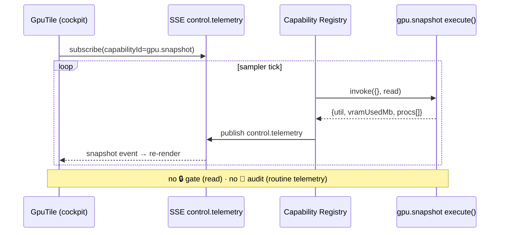
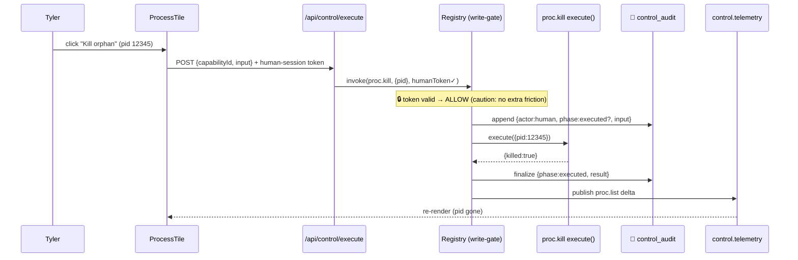
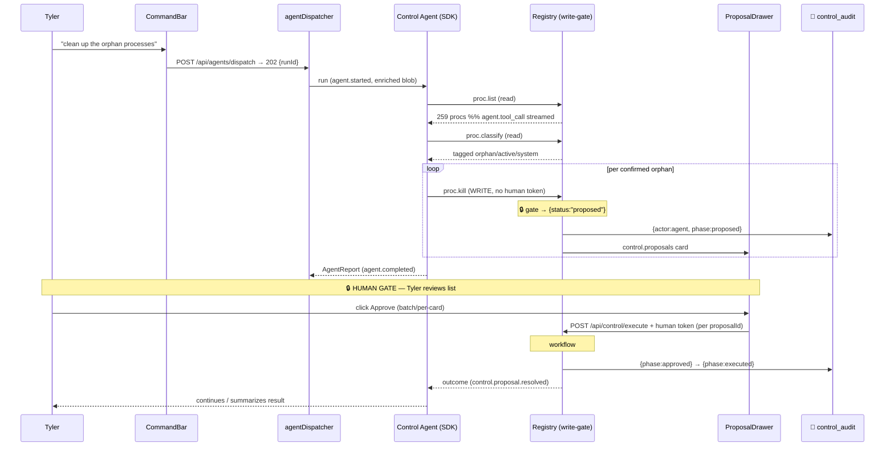
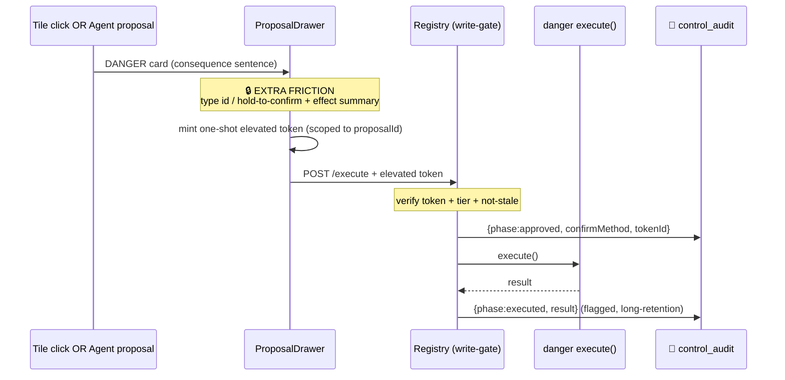
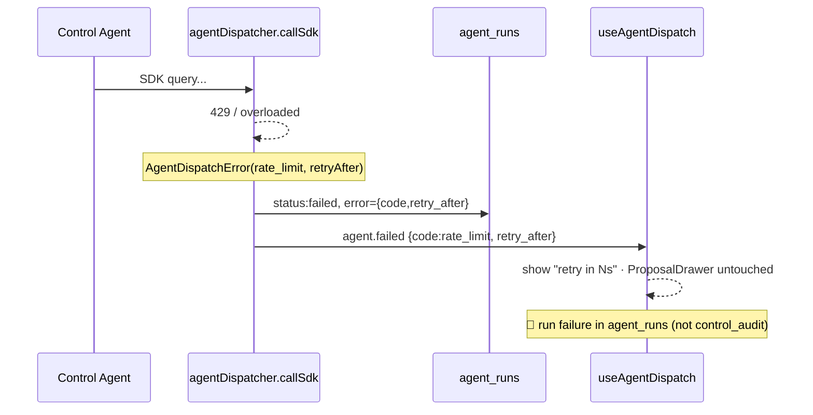
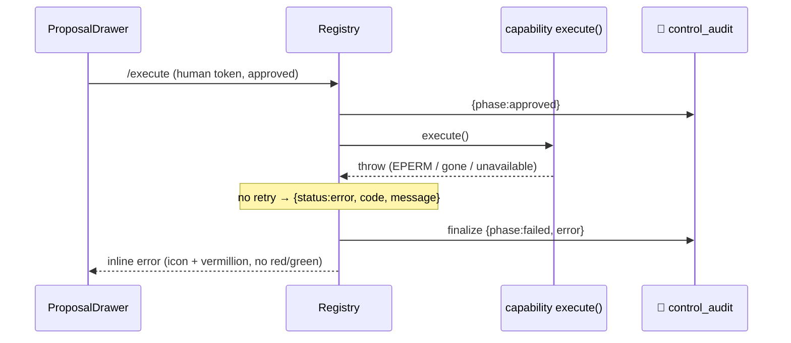

# Control Terminal — Agent Roles & End-to-End Workflows (A3)

> **Data-layer premise superseded (2026-09-10).** This spec was written against a local
> QuestDB serving cache reached over HTTP `:9000` / ILP `:9009` / PG wire `:8812`. That store
> was emptied and retired: all 41 objects were dropped after each was copied to parquet in the
> lake and row-count verified (39/39 exact), and nothing may read or write it again. Market
> data now lives in the Iceberg lake at `E:\lake` and is read **in-process by DuckDB**
> (`from lake.serving import connect`). Everything below that names a database host, port,
> Windows service, JVM process, WAL table, `SAMPLE BY`, materialized-view refresh or ILP
> write is stale and must be re-derived against the lake before it is built.

> Facet doc for the fused Control Terminal. Scope: **who** operates the terminal
> (agent personas) and **how** each core flow runs end-to-end. Companion docs:
> `integration.md` (A1), `capabilities.md` (A2), `pseudocode.md` (A4).
>
> **Non-negotiable invariant (brainstorm 2026-07-22):** every write is
> human-in-loop. Agents **observe and propose only**. A write executes **only**
> on Tyler's click, enforced mechanically at the **Capability Registry
> write-gate** — not by agent good behavior. An agent's "power" is therefore
> defined entirely by *which reads it can call* and *which proposals it can
> generate*, never by what it can execute.

---

## 0. Vocabulary (fixed component names used throughout)

| Component | Role |
|---|---|
| **Capability** | One typed function `execute(input) -> output`, tagged `read` or `write` + a risk tier, exposed 3 ways (cockpit tile / Agent SDK tool / telemetry stream). |
| **Capability Registry** | The single map `capabilityId -> Capability`. Owns the **write-gate**: any `write` capability invoked without a valid human-session token returns `{ status: "proposed" }` and files a `proposed_action`, never executing. |
| **cockpit tile** | The UI surface for one capability (e.g. `ProcessTile`, `GpuTile`). Renders telemetry + the human "run" button. |
| **CommandBar** | Natural-language entry field that dispatches the **Control Agent**. |
| **Control Agent** | The dashboard-embedded, headless Claude Agent SDK run that drives CommandBar intents. |
| **agentDispatcher** | Existing runtime (`src/server/infrastructure/lib/agentDispatcher.ts`) — queue, ring buffer, SDK wrapper, SSE emit. Reused, not rebuilt. |
| **ProposalDrawer** | Client panel that renders `proposed_action` cards streamed over `control.proposals`; holds the Approve / Reject / Approve-all controls. |
| **write-gate** | The registry check that separates a human-token'd call (executes) from an agent call (proposes). |
| **audit log** | `control_audit` table — append-only record of every proposal filed, every human decision, every execution + outcome. |

**SSE channels** (all through the existing event bus / SSE layer):
- `control.telemetry` — high-frequency read snapshots to tiles.
- `control.proposals` — new/updated `proposed_action` cards to the ProposalDrawer.
- `agent.<runId>.<event>` — the **existing** per-run agent stream (`queued`, `started`, `token_chunk`, `tool_call`, `completed`, `failed`; plus `agent.replay`, `heartbeat`, `connected`). Faithful to `agentDispatcher.ts::emitBus` and `useAgentDispatch.ts`.

---

# Part 1 — Agent roles / personas

## 1.1 Roster recommendation: **ONE general Control Agent** (+ prompt-preset personas, not processes)

**Recommendation: a single general Control Agent, not a roster of distinct agent processes.** Optional named "personas" (Reaper / Repo Steward / Data Ops) exist only as **system-prompt + capability-scope presets** layered on the *same* runtime and the *same* dispatcher — they are not separate agents, separate queues, or separate code paths.

**Why one agent wins (the YAGNI argument):**

1. **The write-gate already contains blast radius.** In a system where *no agent can execute anything*, the classic reason to split agents — "limit what the dangerous one can do" — evaporates. A Reaper that can only *propose* `proc.kill` is exactly as safe as a general agent that proposes `proc.kill`; both land in the ProposalDrawer behind Tyler's click. Splitting buys no safety.
2. **Cross-domain intents are the common case.** "Clean up after the last backtest" spans processes (Reaper), the repo's `logs/` (Repo Steward), and lake scratch tables (Data Ops). A roster forces either an orchestrator that re-implements routing, or Tyler manually picking the right specialist. One agent with the full read surface just does it.
3. **`MAX_CONCURRENT = 2`.** The dispatcher runs at most two SDK calls at once. A roster of 3-4 personas cannot run in parallel anyway without starving each other — the concurrency ceiling makes specialization mostly theatre.
4. **One catalog, one prompt-assembly path, one place to reason about tool budget.** Less surface to keep faithful to the registry as capabilities are added.

**When a persona preset earns its keep (the concession):** a preset is worth it only to *narrow the tool budget and sharpen the system prompt* for a repeated, well-scoped chore — e.g. a `reaper` preset that ships with only the process/service read capabilities in its tool list, so the model isn't distracted by 60 unrelated tools and its proposals stay on-topic. This is a **filter over the same registry**, costing one prompt string + one capability-tag allowlist. It is not a new agent. Ship the general agent first; add a preset only when a chore recurs enough that the narrower tool list measurably improves proposal quality. Do **not** pre-build the roster.

### Persona presets (optional, additive — build lazily)

| Preset | Purpose | Read domains it exposes | Proposal (write) tiers it may reach | Risk ceiling |
|---|---|---|---|---|
| **(default) Control Agent** | Any natural-language intent | All four: Machine, Repos, Data/Trading, Agents/External | Any tier (proposals only) | caution — may *propose* danger-tier, but its prompt must flag them explicitly |
| **Reaper** | Process / service hygiene | Machine & Processes (read: `proc.list`, `proc.classify`, `gpu.snapshot`, `svc.status`) | `safe`, `caution` (`proc.kill`) | caution |
| **Repo Steward** | git / build / run across repos | Repos (read: `repo.status`, `git.log`, `build.status`, `run.probe`) | `safe`, `caution` (`git.stash`, `build.clean`) | caution |
| **Data Ops** | Lake / models / backtests | Data/Trading (read: `lake.query`, `model.registry`, `backtest.list`) | `safe`, `caution` (`lake.drop_scratch`, `model.promote` is **danger** → still proposes, prompt must flag) | danger-aware |

> Every preset is the same binary, same dispatcher, same write-gate. The only differences are (a) the system-prompt preamble and (b) the `allowedCapabilityTags` filter that determines which registry entries are compiled into its tool list.

## 1.2 The Control Agent persona (the CommandBar driver)

### System-prompt shape

The prompt is assembled server-side at dispatch (mirroring `agentDispatcher.ts::buildAgentPrompt`, extended for the control domain). Five blocks:

```
[1] IDENTITY
    "You are the Control Agent for Tyler's ml_dashboard Control Terminal.
     You operate a live machine, git repos, a lake/model/backtest stack,
     and external agents — by OBSERVING and PROPOSING. You never execute
     writes; every write you request is queued for Tyler's one-click approval."

[2] HARD RULES
    - READ capabilities are yours to call directly, as many as the budget allows.
    - WRITE capabilities, when you call them, DO NOT execute — the registry
      returns {status:"proposed"} and files a proposal card. Treat that as
      success-of-intent, not success-of-action. Do NOT retry a "proposed"
      result expecting it to run.
    - Never claim a write happened. Say "I've proposed X for your approval."
    - Always gather evidence (reads) BEFORE proposing a write.
    - For any danger-tier capability, state the irreversible consequence in
      one sentence inside the proposal's rationale.

[3] CAPABILITY CATALOG  (see "How it references the catalog", §1.2.3)
    A compact list: for each in-scope capability — id, one-line purpose,
    read|write, risk tier, input schema summary. The FULL schemas are the
    SDK tool definitions; this block is the index the model reasons over.

[4] CONTEXT BLOB (server-enriched)
    The thin CommandBar blob {intent, activeTile?, selection?, focusRepo?}
    enriched server-side (live snapshots the agent would otherwise have to
    fetch) — same enrichContextBlob pattern, gracefully marking any
    unavailable source with {_unavailable:true, reason}.

[5] OUTPUT CONTRACT
    Stream reasoning as text (-> agent.token_chunk). Call tools as needed
    (-> agent.tool_call). Finish with an AgentReport JSON:
    summary, body(markdown), findings[], proposedActions[].
```

### Tool budget

- **Read tools: unmetered within a soft cap.** Reads are cheap and side-effect-free. Cap at **~20 read tool-calls per run** as a runaway guard (a run scanning 259 processes + 30 repos should still finish in well under that with batched capabilities). If it hits the cap, the agent must summarize with what it has.
- **Write (propose) tools: capped at 12 proposals per run.** More than a dozen queued cards is a signal the agent misunderstood scope — it should instead propose a smaller first batch and say so. (See workflow #5 for how the drawer batches.)
- **Wall clock:** bounded by the dispatcher's existing `SDK_TIMEOUT_MS = 10 min`. No change.
- **Concurrency:** bounded by `MAX_CONCURRENT = 2`. A second CommandBar dispatch while two run queues normally (status `queued`).

### When to *propose* vs when to just *report*

The agent chooses per-intent using this decision rule:

| Situation | Behavior |
|---|---|
| Intent is a question ("what's using my GPU?", "which repos are dirty?") | **Report only.** Reads + an `AgentReport` with findings. Zero proposals. |
| Intent implies change but the *right change is unambiguous and evidence supports it* ("kill the orphan node processes") | **Propose.** Reads to classify, then one `proc.kill` proposal per confirmed orphan (or one batched proposal), each with evidence in the finding. |
| Intent implies change but evidence is ambiguous or risky | **Report + a narrow proposal + an explicit caveat.** e.g. "3 of these look active — I've proposed killing only the 5 I'm confident are orphaned; the other 3 need your eyes." Never propose a danger-tier write speculatively. |
| Intent would require a write the agent's preset can't reach | **Report the gap.** "This needs `model.promote` (danger tier) — outside my scope; here's the manual path / I can propose dispatching the `ml-eval` specialist first." |

**Principle:** a proposal is a *claim backed by evidence*, not a guess. If the agent can't attach a `finding` with a metric/reference justifying the write, it reports instead of proposing.

### How it references the capability catalog

- The registry is the **single source of truth**. At dispatch, the server compiles the in-scope subset (per preset `allowedCapabilityTags`) into two artifacts: (a) the **SDK tool definitions** (full JSON input schemas — this is what the model actually calls) and (b) the **catalog index block** in the prompt (id + purpose + read/write + tier — what the model reasons over to *pick* a tool).
- The agent never hard-codes capability ids; it selects from the index. Adding a capability to the registry with the right tags makes it automatically visible to the agent on the next dispatch — no prompt edit.
- `read`/`write`/`risk` tags travel with each catalog entry so the agent's propose-vs-report logic and its danger-flagging are driven by registry metadata, not memorized rules.

## 1.3 Permission / risk model as it applies to roles

Two orthogonal axes, ANDed at call time:

**Axis 1 — capability risk tier** (property of the capability, in the registry):

| Tier | Meaning | Human gate |
|---|---|---|
| `safe` | Read, or a trivially reversible write (e.g. clear a cache tile) | writes still gated, but 1-click, no friction |
| `caution` | Reversible-with-effort write (`proc.kill`, `git.stash`, `build.clean`, `lake.drop_scratch`) | 1-click approve in ProposalDrawer |
| `danger` | Irreversible / outward-facing / money / model-lineage (`broker.order`, `model.promote`, `git.push`, `svc.stop` on a shared service) | **explicit confirm with extra friction** (typed token / hold-to-confirm), regardless of driver |

**Axis 2 — role scope** (property of the preset): the `allowedCapabilityTags` allowlist decides which capabilities are even *visible* to that agent run.

**How they interact with the global write-gate:**

```
agent calls capability C
        │
        ▼
  is C in this preset's allowedCapabilityTags?  ── no ──▶ tool not present; agent can't call it
        │ yes
        ▼
  registry.invoke(C, input, humanToken=NONE)
        │
        ▼
  C.access === 'read' ? ── yes ──▶ execute, return data   (no gate; reads are free)
        │ no (write)
        ▼
  WRITE-GATE: humanToken absent
        │
        ▼
  return {status:"proposed"}  +  file proposed_action (tier=C.tier)
        │
        ▼
  proposal streams to ProposalDrawer; NOTHING executed
```

The **role's "power" is only its read+propose reach.** A Reaper and the general agent that both propose the same `caution` `proc.kill` produce an identical gated proposal card. The tier (`caution` vs `danger`) determines the *friction Tyler faces*, not what the agent could do. This is why the roster question is a UX/prompt-quality question, not a security question — the security is the gate, and the gate is invariant across all roles.

## 1.4 Relationship to the existing 68-agent dispatch system

- Tyler's **68 CLI agents** in `C:\Users\tyler\.claude\agents\` are *authoring-time* Claude Code subagents (Task-tool dispatch, filesystem-scoped, spawned in a coding session). They are **not** these control agents.
- The **Control Agent(s)** are **dashboard-embedded, headless, Agent SDK runs** through `agentDispatcher.ts` — no filesystem write authority, no Task tool, output constrained to the `AgentReport` contract, every write behind the terminal's write-gate. Different runtime, different trust model, different lifecycle.
- **Bridge:** the Control Agent CAN *propose* dispatching one of the 68 via an **`agent.dispatch` capability** (a `write`, tier `caution`). Flow: the Control Agent decides "this needs the `ml-eval` specialist," calls `agent.dispatch({agentId:"ml-eval", context})` → write-gate → proposal card "Dispatch ml-eval specialist for X" → Tyler approves → the terminal invokes the dispatch. So the dashboard agent orchestrates the CLI roster *through the same human gate*, never directly.

---

# Part 2 — End-to-end workflows

Legend for every diagram: **🔒 = human-in-loop gate** · **📓 = audit-log write**.

Audit-log (`control_audit`) row shape referenced below:
`{ id, ts, actor(human|agent:<runId>), capabilityId, tier, phase(proposed|approved|rejected|executed|failed), input, result|error, proposalId?, humanToken? }`

---

## Workflow 1 — Live telemetry flow (streamed read)

A `read` capability (e.g. `gpu.snapshot`) pushing to a cockpit tile. No gate — reads are free; no audit row for routine telemetry (audit is for writes + decisions).

**Steps:**
1. On tile mount, `GpuTile` opens an SSE subscription to `control.telemetry` filtered to `capabilityId=gpu.snapshot`.
2. A server-side sampler ticks (interval or on-demand) and calls `registry.invoke("gpu.snapshot", {}, humanToken=n/a)`.
3. `execute()` reads `nvidia-smi` / the machine probe, returns a typed snapshot `{util, vramUsedMb, vramTotalMb, procs[]}`.
4. The registry publishes the snapshot to the event bus as a `control.telemetry` event `{capabilityId, ts, payload}`.
5. The SSE layer fans it out; `GpuTile` receives it and re-renders (VRAM bar, per-proc rows).
6. Telemetry is **not** audit-logged (high-frequency reads). Only capability *errors* are logged (as a `failed` telemetry marker), not every sample.



**Gate:** none (read). **Audit:** none for samples; capability throw → one `failed` telemetry marker.

---

## Workflow 2 — Human direct write (Tyler clicks a tile button)

The baseline write path. Tyler clicks "Kill orphan" on a `ProcessTile`. This is the path *every* approved proposal ultimately funnels into (workflows 3–5 converge here).

**Steps:**
1. Tyler clicks **Kill orphan** on `ProcessTile` for pid `12345`.
2. Client POSTs `/api/control/execute` `{ capabilityId:"proc.kill", input:{pid:12345} }` with the **human-session token** attached (session cookie / CSRF-bound header — proves a human click, not an agent).
3. The route calls `registry.invoke("proc.kill", {pid:12345}, humanToken=<valid>)`.
4. **🔒 Write-gate:** token present + valid → gate **allows** execution. (Tier `caution` → no extra friction. Had it been `danger`, see workflow 4.)
5. **📓 Audit:** append `{phase:"executed"...}` is written *around* the call — a `proposed?`-less direct execution logs `actor:"human"`, `phase:"executed"` on success (or `phase:"failed"` on throw).
6. `execute()` runs (`process.kill(12345)`), returns `{killed:true, pid:12345}`.
7. The registry publishes a `control.telemetry` update for `proc.list` (or emits an invalidation) so `ProcessTile` re-renders with pid gone.
8. Client shows a toast; the tile row disappears.



**Gate:** 🔒 at step 4 — human-session token is the gate key. **Audit:** 📓 two-phase row (`executed` / `failed`) with `actor:"human"`, capability, input, result.

---

## Workflow 3 — Agent-proposed write (the key flow)

"Clean up the orphan processes" typed in CommandBar. The Control Agent reads, classifies, proposes; Tyler approves; execution reuses workflow 2.

**Steps:**
1. Tyler types **"clean up the orphan processes"** in CommandBar.
2. Client POSTs `/api/agents/dispatch` `{agentId:"control"(or preset "reaper"), contextBlob:{intent, activeTile:"process"}}` → `202 {runId}`. (Same contract as `useAgentDispatch.ts`.)
3. `agentDispatcher.dispatch()` inserts the `agent_runs` row (`queued`), primes the ring buffer, kicks the scheduler. Client attaches SSE `/api/events/agents/<runId>` and the ProposalDrawer subscribes to `control.proposals` filtered to `runId`.
4. Dispatcher runs the job: emits `agent.started`; enriches the blob (live `proc.list` snapshot injected server-side).
5. Agent calls **`proc.list`** (read, direct) → registry executes, returns 259 processes. Emits `agent.tool_call {tool:"proc.list"}`.
6. Agent calls **`proc.classify`** (read, direct) → returns each process tagged `{orphan|active|system}` with evidence (ppid=1 / no controlling tty / idle CPU / not a protected service). Emits `agent.tool_call`.
7. For each confirmed orphan, agent calls **`proc.kill`** (WRITE). Because the run carries **no human token**, the **write-gate returns `{status:"proposed"}`** and files a `proposed_action` `{proposalId, runId, capabilityId:"proc.kill", tier:"caution", input:{pid}, finding:{...evidence}}`.
8. **📓 Audit:** each filed proposal writes `{actor:"agent:<runId>", phase:"proposed", capabilityId, input}`.
9. Each proposal streams to the ProposalDrawer over `control.proposals` as a card (grouped by `runId` — see workflow 5 for batching). Cards show the categorized kill list with per-pid evidence.
10. Agent finishes with an `AgentReport`: `summary:"Found 14 orphans (12 node, 2 python); proposed kills. 3 ambiguous left for you."`, `findings[]`, `proposedActions[]`. Emits `agent.completed`. The streamed reasoning already rendered live via `agent.token_chunk`.
11. **🔒 Human-in-loop gate:** Tyler reviews the categorized list in the ProposalDrawer and clicks **Approve** on the batch (or per-card).
12. On Approve, the drawer executes **exactly workflow 2** per approved proposal: POST `/api/control/execute` with the **human-session token**, referencing `proposalId`. Gate allows → `execute()` runs → 📓 `{phase:"approved"}` then `{phase:"executed", proposalId}`.
13. **Agent notified of outcome:** the execution result is posted back to the run (a `control.proposal.resolved` event, or a follow-up dispatch turn carrying the outcomes). The agent continues — e.g. re-checks `proc.list` — and summarizes: "Killed 12; 2 already gone; VRAM freed 3.1 GB."



**Gate:** 🔒 twice — (a) the write-gate turns every agent `proc.kill` into a proposal (step 7), (b) Tyler's Approve click (step 11) is the human authorization. **Audit:** 📓 `proposed` per card (actor:agent), then `approved` + `executed`/`failed` per approved card (actor:human), all sharing `proposalId` + `runId` for lineage.

---

## Workflow 4 — Dangerous capability (extra friction, driver-independent)

A `danger`-tier capability (e.g. `broker.order`, `model.promote`, `git.push`). The difference from `caution` is **friction at the approval step**, and it applies whether the driver was a tile click or an agent proposal.

**Steps:**
1. Origin is either: (a) Tyler clicks a danger action on a tile, or (b) the Control Agent proposes it (e.g. after an eval run it proposes `model.promote({runId, alias:"best"})`).
2. If agent-originated: same as workflow 3 steps 7–9 — write-gate returns `proposed`, card filed, 📓 `proposed`. The card is **badged `DANGER`** and carries the agent's mandatory one-sentence irreversible-consequence rationale (enforced by the system prompt).
3. **🔒 Extra-friction gate:** approving a `danger` card does **not** accept a plain click. The ProposalDrawer requires a **second factor of intent** — e.g. type the capability name / affected id to confirm (`type "model.promote MNQ-xff2" to promote`), or hold-to-confirm 2s, plus a visible summary of the irreversible effect. For `broker.order`: show notional, side, symbol, and require the typed symbol+qty.
4. The confirm produces a **one-shot elevated human token** scoped to `{proposalId, capabilityId}` — it authorizes exactly that one execution, not a session-wide grant.
5. POST `/api/control/execute` with the elevated token. Registry checks: token valid **and** tier-matched **and** proposal not stale (TTL) → allow.
6. **📓 Audit:** `danger` rows record the extra-friction proof (`confirmMethod:"typed"|"hold"`, the elevated token id) alongside `{phase:"executed"}`. These rows are retained longer / flagged for review.
7. `execute()` runs; result streams back; agent (if origin b) is notified and must report the outcome factually ("Promoted MNQ-xff2 to `best`. Previous `best` archived.").

**Difference from `caution` at a glance:**

| | `caution` (workflow 2/3) | `danger` (workflow 4) |
|---|---|---|
| Approve gesture | single click | typed-token / hold-to-confirm + effect summary |
| Token | session token | one-shot elevated token scoped to the proposal |
| Card badge | normal | `DANGER` + mandatory consequence sentence |
| Proposal TTL | lenient | short (staleness check on execute) |
| Audit | standard row | + confirm-method + longer retention/flag |
| Agent may propose speculatively? | yes (with evidence) | no — only when evidence directly supports it, always consequence-flagged |



**Gate:** 🔒 elevated, driver-independent — the extra friction is a property of the *tier*, so an agent-proposed danger write and a human-initiated one face the identical confirm. **Audit:** 📓 enriched row with confirm proof.

---

## Workflow 5 — Multi-step agent plan (batched proposals, partial approval)

The Control Agent proposes several writes from one intent (e.g. "get this repo ready to commit" → `build.clean` + `git.stash` untracked junk + kill 3 stale dev servers). The ProposalDrawer manages the batch.

**Steps:**
1. One dispatch, one `runId`. The agent reads (repo status, process list, build state), then files N proposals (each gated → `proposed`, workflow 3 step 7). All share `runId` and a `planId` (= `runId` here) so the drawer groups them.
2. Proposals stream to the drawer as a **single grouped plan card** with N child rows, ordered by the agent's stated sequence, each with its own tier badge and evidence. A plan header shows: "5 proposed actions — 3 caution, 1 danger, 1 safe."
3. **Batching semantics:** the drawer offers **Approve all** (executes children in the agent's declared order), **Approve selected** (checkboxes — partial approval), and **Reject** per child or whole plan.
4. **🔒 Human gate — partial approval is first-class.** Tyler unchecks the danger child, checks the other four, clicks **Approve selected**.
   - `danger` children are never swept into "Approve all" without their own extra-friction confirm (workflow 4) — "Approve all" surfaces a nested confirm for each danger child rather than bypassing it.
5. **Execution order + dependency:** the drawer executes approved children **sequentially** (respecting `MAX_CONCURRENT` isn't relevant — these are registry executes, not agent runs), in declared order. Each child = one workflow-2 execute with the human token, referencing its `proposalId`.
6. **Partial-failure handling:** if child 3 of 4 throws, execution **stops by default** (fail-closed) and the drawer marks 1–2 `executed`, 3 `failed`, 4 `skipped`. Tyler chooses **Continue anyway** (run 4) or **Stop**. Nothing auto-rolls-back — the audit trail is the record; reversal (if any) is a new proposal.
7. **📓 Audit:** one `proposed` row per child (actor:agent), then per approved child `approved`+`executed`/`failed`/`skipped` (actor:human), all sharing `planId`. Rejected children log `{phase:"rejected", actor:human}`.
8. The agent is notified of the per-child outcomes (which approved, which rejected, which failed) and summarizes honestly: "Cleaned build + stashed junk + killed 2 servers. You declined the `git.push`. Server pid 991 refused to die — still running."

```mermaid
sequenceDiagram
    participant Agent as Control Agent
    participant Reg as Registry (write-gate)
    participant Draw as ProposalDrawer
    participant Aud as 📓 control_audit
    Agent->>Reg: N writes (build.clean, git.stash, 3× proc.kill, git.push)
    Note over Reg: 🔒 each → {status:proposed}
    Reg->>Aud: N× {phase:proposed, planId}
    Reg->>Draw: grouped plan card (N children, tiers)
    Note over Draw: 🔒 HUMAN GATE — partial approval
    Draw->>Draw: Tyler unchecks danger child, checks 4
    Draw->>Reg: execute selected, sequential, per proposalId + human token
    alt child fails
        Reg->>Aud: {phase:failed}
        Note over Draw: fail-closed → mark rest skipped; ask Continue/Stop
    else all ok
        Reg->>Aud: {phase:executed}×
    end
    Draw->>Aud: rejected child → {phase:rejected}
    Reg-->>Agent: per-child outcomes → honest summary
```

**Gate:** 🔒 per-plan with per-child granularity; danger children keep their own extra-friction confirm even under "Approve all". **Audit:** 📓 `proposed`/`approved`/`executed`/`failed`/`skipped`/`rejected` per child, joined by `planId`.

---

## Workflow 6 — Failure / rate-limit (reuse the dispatcher's structured errors)

Two failure surfaces: (A) the Agent SDK 429s, (B) a capability `execute()` throws. Both reuse existing structured handling — no new machinery.

### 6A — Agent SDK 429 / rate-limit

**Steps:**
1. Control Agent run is in flight; the SDK call hits a 429 / `overloaded`.
2. `agentDispatcher.callSdk` already detects this — the `result`/`rate_limit` message path or the `catch` regex `/429|rate.?limit|overloaded/i` → throws `AgentDispatchError(code:"rate_limit", retryAfter)`.
3. `runJob` writes the `agent_runs` row `status:"failed"`, `error = {"code":"rate_limit","retry_after":<s>,"message":...}` (JSON) and emits `agent.failed {error, code:"rate_limit", retry_after}`.
4. Client `useAgentDispatch.onFailed` sets `status:"failed"`, surfaces the error. The CommandBar shows "Rate-limited, retry in Ns" using `retry_after`. **No proposals were filed**, so the ProposalDrawer is untouched — nothing partial to clean up.
5. **📓 Audit:** the *run* failure is an agent-lifecycle event (in `agent_runs`), not a `control_audit` write — `control_audit` only records capability proposals/executions, and none occurred. If the agent had already filed proposals *before* the 429, those `proposed` rows stand; the drawer keeps them (they're still valid to approve independently of the agent being dead).
6. Retry is Tyler re-submitting the CommandBar (a fresh `runId`), optionally after `retry_after`. The ring buffer of the dead run is dropped after 60 s (existing behavior).

### 6B — Capability execute() throws (during a human-approved execute)

**Steps:**
1. Tyler approved a `proc.kill` (or any write); `/api/control/execute` calls `registry.invoke` with the human token; `execute()` throws (e.g. `EPERM`, pid already gone, lake unreachable).
2. The registry catches, does **not** retry, and returns a structured `{status:"error", code, message}` (mirroring `AgentDispatchError` shape: `rate_limit`|`sdk_error`|`timeout` for agent calls; for capabilities use `exec_error`|`not_found`|`permission`|`unavailable`).
3. **📓 Audit:** the pre-written `{phase:approved}` row is finalized as `{phase:"failed", error:{code,message}}` — the attempt is permanently recorded even though nothing changed.
4. The tile / drawer shows the failure inline on that row (red-free per Tyler's deuteranopia — use an error icon + `#D55E00` vermillion, never red/green); the item stays in the list if the kill didn't take.
5. If the failure happened inside a **plan** (workflow 5), fail-closed applies — remaining children marked `skipped`, Tyler chooses Continue/Stop.
6. If the driver was the agent-notify loop (workflow 3 step 13), the agent receives the failed outcome and reports it factually — never claims success.





**Gate:** unchanged — failures happen *after* the human gate (6B) or *before* any write (6A). **Audit:** 6A → run failure in `agent_runs` only (no capability touched); pre-existing proposals persist. 6B → the `approved` audit row is finalized to `failed` with the structured error code.

---

## Cross-workflow invariants (the through-line)

1. **The write-gate is the single security boundary.** Every write path — tile click, agent proposal, plan child, danger action — funnels through `registry.invoke` and is separated solely by presence of a valid human token. Agents structurally *cannot* execute.
2. **Reads never gate, never audit routinely.** Only capability errors on reads leave a marker.
3. **Every write leaves an audit lineage** — `proposed`(if agent-origin) → `approved` → `executed`|`failed`, joined by `proposalId`/`planId`/`runId`.
4. **Agents report truthfully about proposals vs executions.** The system prompt forbids "I killed X"; only "I proposed X" until an execution outcome returns.
5. **Faithful to the existing runtime** — `agent.*` SSE event kinds, `MAX_CONCURRENT=2`, ring-buffer replay, and the `AgentDispatchError` code taxonomy are reused verbatim; the terminal adds only `control.telemetry` + `control.proposals` channels and the `control_audit` table.

---

## Takeaway

**Ship one general Control Agent, not a roster.** Because the registry write-gate makes *every* agent write a gated proposal, splitting agents buys zero safety — it only adds routing overhead the `MAX_CONCURRENT=2` ceiling already punishes. The one lever specialization actually pulls (a tighter tool list → sharper proposals) is captured far more cheaply by an optional **prompt-preset + capability-tag filter** over the same runtime, added lazily only when a chore recurs. Build the general agent, wire the six workflows around the invariant write-gate, and add a `reaper`/`repo-steward`/`data-ops` preset later if — and only if — proposal quality on that chore measurably needs it.
