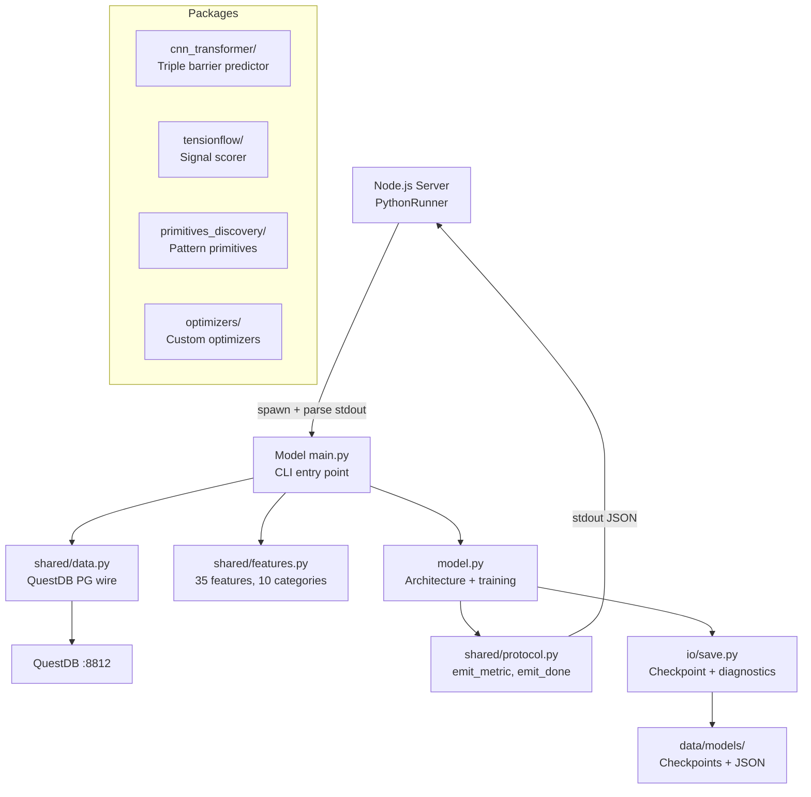

# ML — Python Machine Learning Engine

Python ML models and shared utilities for quantitative trading research. Model packages + shared infrastructure. All models communicate with the Node.js server via a JSON stdout protocol (`shared/protocol.py`).

## Architecture



## Directory Structure

```
src/ml/
  shared/               Shared across ALL models
    protocol.py         JSON stdout event emitters (emit_metric, emit_done, etc.)
    data.py             QuestDB OHLCV loading via PG wire (psycopg2)
    features.py         Config-driven feature computation (35 features, 10 categories, Numba JIT)
    normalizer.py       Feature classification (8 types) + transform functions
    feature_extract.py  Indicator-to-feature derivation (8 transforms, Numba JIT, joblib parallel)
    feature_correlation.py  Pairwise correlation, hierarchical clustering, batch VIF
    feature_importance.py   Permutation importance, mutual information, SHAP wrapper
    diagnostics.py      Diagnostics output formatting
    diagnostics_schema.py   Pydantic schema mirroring TypeScript SelfDescribingDiagnostics
    trajectory.py       Weight snapshot recorder + PCA projection for 3D visualization
    loss_surface.py     Li et al. 2018 filter-normalized 2D loss landscape
    swing.py            Causal zigzag detection (no lookahead)
    optimizer.py        Custom optimizer implementations
    signals.py          Signal processing utilities
    shmem.py            Shared memory utilities
    labeling/           Label generation strategies
    primitives/         Pattern primitive detection

  cnn_transformer/      CNN+Transformer triple barrier predictor (extracted to separate repo)
    (Located at E:\source\repos\cnn_transformer — not in this directory)

  tensionflow/          Physics-based signal scorer
    scorer.py           Main scorer (5 signals, confluence + alignment gates)
    config.py           Configuration constants
    features/           Spatial, volume, derived features
    signals/            Band direction, momentum, spatial, structure, volume profile
    tension/            Composite tension + delta computation
    state/              History, hysteresis, regime tracking
    risk/               Confidence, drawdown, sizing, stops
    trade/              Confluence, context, flip, strength, threshold
    patterns/           Pattern detection

  primitives_discovery/ Pattern primitive discovery
  optimizers/           Custom optimizer implementations
```

## Stdout Protocol

All models communicate with the server via JSON lines on stdout. The protocol is defined in `shared/protocol.py`:

| Event Type | Purpose | Receiver |
|---|---|---|
| `progress` | Iteration/phase progress bar | Training UI progress |
| `metric` | Per-iteration numeric metric | SSE -> streaming metric panels |
| `metric_declarations` | Self-describing metric schema | Dashboard pre-configures renderers |
| `overlay` | Chart overlay (regime zones, predictions) | TradingChart regime coloring |
| `model_state` | Full model state snapshot | Visualization components |
| `log` | Human-readable log message | Training log panel |
| `done` | Training complete + diagnostics JSON | Checkpoint persistence |
| `error` | Training failed | Error handling |

## CNN+Transformer Model (113 features, ~6M params)

The primary production model. Triple barrier labels (Lopez de Prado, 2018) with ATR-scaled TP/SL/timeout.

**Input features (113)**:
- OHLCV base (5): normalized price + volume
- Encodings (45): cyclical, session, time-to-event, target, frequency, interaction
- Discrepancy (28): volume anomaly, price-volume divergence, bar structure, outlier scores
- Categorical (35): label, one-hot, target encoding for 5 derived categories

**Architecture**: Conv1d(128->256) + SoftQuantization(K=32) + TransformerEncoder(8 layers, 8 heads, d=256) + 3 output heads (barrier class, vol regime, return bucket)

**Training**: 8-fold walk-forward, Optuna HPO, cost-adjusted profit factor objective ($2.80 RT MNQ costs)

## Key Performance Optimizations

- **Numba JIT**: Rolling z-score, rolling stats, percentile rank (~50x vs pandas on 500k+ rows)
- **O(1) memory normalization**: Online algorithm instead of sliding_window_view (avoids OOM at 2.3M rows)
- **Joblib parallel**: Feature extraction + permutation importance parallelized across cores
- **Polars correlation**: Rust-native ranking + numpy corrcoef (~3x vs scipy)
- **Batch VIF**: Single matrix inverse instead of D separate OLS regressions
