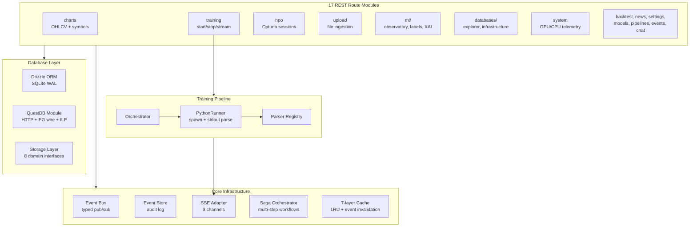

# Server — NestJS + Express 5 Backend

TypeScript backend combining NestJS dependency injection with Express 5 routing. Serves the React client, proxies QuestDB queries, orchestrates ML training via Python subprocess management, and broadcasts real-time updates via SSE.

## Architecture



## Directory Structure

```
src/server/
  main.ts              Bootstrap: Express + NestJS + middleware + startup
  app.module.ts        NestJS root module
  nest-context.ts      Global NestJS app reference
  core/
    routes.ts          Route registration (17 routers on /api)
    static.ts          Static file serving (production)
    vite.ts            Vite dev middleware
    manifest.service.ts  Hardware/infrastructure auditing
    system.controller.ts  NestJS system controller
    config/            App configuration module
    filters/           HTTP exception filters
    health/            Health check indicators (SQLite, QuestDB)
    swagger/           OpenAPI spec generation
  routes/              17 route modules (Express routers)
    ml/                Observatory, sessions, labels, XAI, forecasts
    databases/         DB explorer, infrastructure health
  database/
    db.ts              Drizzle SQLite connection (WAL mode)
    health.ts          Cross-DB health + circuit breaker
    database.module.ts NestJS database DI module
    questdb.service.ts QuestDB NestJS facade
    sqlite.service.ts  SQLite NestJS facade
    questdb/           Low-level QuestDB operations (7 modules)
  cache/               7 instrumented caches (OHLCV, query, symbols, model, labels, parquet, anchor)
  storage/             Drizzle query layer (8 domain interfaces)
  events/              Event bus + event store + SSE adapter
  sagas/               Saga orchestrator + recovery
  training/            Training orchestrator + runners + parsers
    runners/           PythonRunner (spawns ML scripts, parses stdout)
    hpo/               HPO orchestration (Optuna integration)
  lib/                 Business logic libraries
    backtest/          Backtesting engine (10 modules)
    labels/            Label generation (15+ generators)
    xai/               Explainability methods (9 XAI methods)
    ingestion/         File upload + standardization
    motivewave/        MotiveWave file watcher
    news/              News fetcher + sentiment
  types/               TypeScript type definitions
```

## Key Patterns

- **Training protocol**: Python scripts communicate via stdout JSON lines. `PythonRunner` spawns processes, parser registry routes events by model type, SSE broadcasts to connected clients.
- **Event-driven cache**: All 7 caches listen to typed events (ingestion, model, training) for automatic invalidation. Stats exposed via `/api/databases/cache-stats`.
- **Circuit breaker**: Auto-disables failing DB connections (closed -> open -> half-open states). Resetable via `POST /api/databases/circuit-breaker/reset/:name`.
- **Saga orchestrator**: Multi-step workflows (ingest -> feature compute -> train -> deploy) with recovery on failure.
- **Storage layer**: Routes call `storage.*` methods (abstraction) -- never inline Drizzle queries in route handlers.
- **Rate limiting**: API 100/min, ML 50/min, upload 10/min.
- **Request IDs**: Every response includes `X-Request-ID` header for tracing.
- **Compression**: gzip middleware + pre-compressed .gz/.br static assets at build time.

## API Route Map

| Mount | Purpose |
|---|---|
| `/api/charts` | OHLCV candles + symbols (QuestDB SAMPLE BY, futures stitching) |
| `/api/training` | Training: start, stop, SSE stream, config, history, diagnostics |
| `/api/hpo` | Optuna HPO: start, stop, SSE stream, sessions, trials |
| `/api/ml` | Observatory, sessions, labels (16 generators), XAI (9 methods), forecasts |
| `/api/upload` | File upload + OHLCV ingestion (CSV, ZST, Parquet, DBN; 500MB max) |
| `/api/instruments` | Instrument metadata, feature importance |
| `/api/databases` | DB explorer, infrastructure health, cache stats |
| `/api/backtest` | Walk-forward, Monte Carlo, benchmark, SSE progress |
| `/api/system` | GPU/CPU telemetry |
| `/api/models` | Model checkpoints + predictions (12 endpoints) |
| `/api/news` | News articles + sentiment |
| `/api/settings` | User preferences, connectivity tests |
| `/api/model-catalog` | 300+ model specs browsing |
| `/api/events` | SSE event bus (per-channel) |
| `/api/pipelines` | Event-sourced pipeline state (CQRS) |
| `/api/chat` | Ollama LLM chat (streaming SSE) |
| `/api/motivewave` | File watcher config, manual import |
